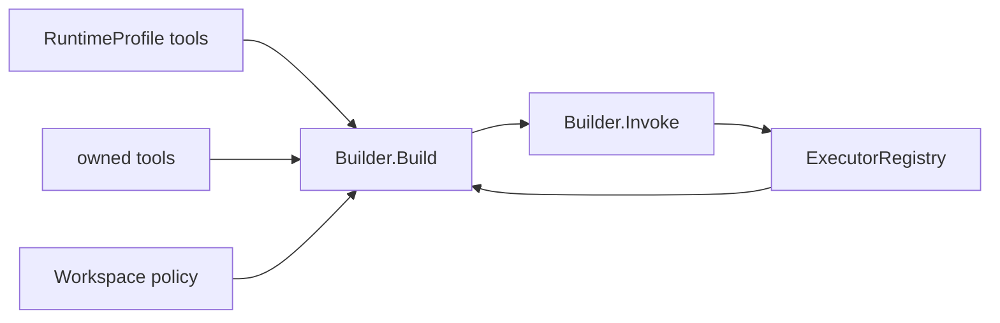

# Toolkit

[Go API Reference](https://pkg.go.dev/github.com/GizClaw/gizclaw-go/pkgs/gizclaw/services/runtime/toolkit)

`toolkit` 拥有持久化 Tool 资源、executor registry，以及针对一次 Agent runtime 构造的 ToolKit view。

`Builder.Build` 先读取当前 RuntimeProfile 的 Tool map value，再读取 owner KV index，并去重、过滤不存在的 Tool。Tool 的 enabled、exposure policy 和 executor availability 仍在 build 与 invoke 时校验。RuntimeProfile 只授予 list/get/use，不授予 put/delete；owner 可以完整管理自己的 Tool。

Alias 不进入 Tool RPC 或 executor name。Profile 中 `weather: weather-v2` 表示允许真实 Tool `weather-v2`；Agent 和客户端仍以真实 Tool 名调用。
