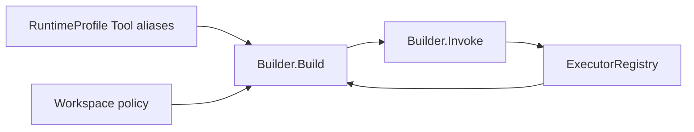

# Toolkit

[Go API Reference](https://pkg.go.dev/github.com/GizClaw/gizclaw-go/pkgs/gizclaw/services/runtime/toolkit)

`toolkit` 拥有真实 Tool 存储、executor 注册，以及 Agent runtime 使用的 ToolKit view。真实 Tool 统一由 Admin 管理。

`Builder.Build` 从当前 RuntimeProfile snapshot 解析符号 Tool alias，再应用 Workspace policy、Tool enabled/exposure 规则和 executor availability。Peer list/get 只返回 alias i18n 与安全 input/output schema。调用时由 Server 内部把 alias 解析为真实 Tool 和 executor。

Peer 请求不能在 alias 字段中提交真实 Tool ID，也不能修改 Tool 或 executor definition。
