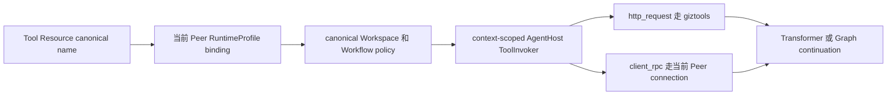

# Tools

[Go API Reference](https://pkg.go.dev/github.com/GizClaw/gizclaw-go/pkgs/gizclaw/services/runtime/toolkit)

`toolkit` 负责 typed Tool Resource 的持久化、公共校验、防御性快照与
canonical-name policy 过滤。`ToolResource.metadata.name` 是唯一 Tool
identity；Resource 存储、RuntimeProfile binding、`ToolkitPolicy.tool_ids`、
模型声明与调用都使用完全相同的名字。RuntimeProfile map key 只用于展示和配置，
绝不是调用 alias。

目前支持两种 Tool：

- `http_request` 声明一个固定 HTTPS `GET` 或 JSON `POST` 操作。参数通过
  RFC 6901 pointer 映射到 query 或 body field；status、response pointer、
  timeout 与 response size 都由 Resource 固定。
- `client_rpc` 调用当前已连接 Peer SDK 中按 canonical name 挂载的 handler。
  该分支没有 method、handler ID、Peer ID、endpoint 或 Credential 配置。

Resource contract 中不存在 `source`、`builtin`、executor registry、第二个 Tool
ID、`output_schema` 或 provider ToolCall ID。

## HTTP auth 与 transport

HTTP auth 是封闭 union：`none`、`bearer`、`header_api_key`、`volc_ark`、
`volc_search`、`volc_openapi`、`aliyun_app_code`、
`aliyun_openapi_v3`。Bearer token 与 header API key 是 write-only Resource
field：同一方法更新时省略 secret 会保留，提供新值会轮换，切换方法会删除旧
secret。Admin read、RuntimeProfile projection、model definition、日志与结果都
不会返回这些值。

Provider auth 在每次调用时解析一个 `volc` 或 `aliyun` Credential。Volc
Ark/Search 使用固定 API-key field；Volc OpenAPI 与阿里云 OpenAPI V3 对最终
request 签名；阿里云市场使用 AppCode。`pkgs/giztools` 只包含无状态执行 helper：
有界 HTTP request mapper/executor，以及针对当前 connection 的
`client.tool.invoke` wire client；它不解析 Resource、policy、RuntimeProfile，
不选择 Peer，也不实现 `genx.ToolInvoker`。

HTTP 仅允许 HTTPS，关闭 redirect 与环境 proxy；每次连接都检查全部 DNS 结果，
拒绝 private、loopback、link-local、multicast、unspecified、运营商 NAT 与
Server 配置的 denied network；同时校验 JSON status、content type、大小、语法和
response pointer。执行不会自动重试。

## Runtime 链路

```mermaid
flowchart LR
    Resource["Tool Resource canonical name"] --> Profile["当前 Peer RuntimeProfile binding"]
    Profile --> Policy["canonical Workspace 和 Workflow policy"]
    Policy --> Invoker["context-scoped AgentHost ToolInvoker"]
    Invoker --> HTTP["http_request 走 giztools"]
    Invoker --> Client["client_rpc 走当前 Peer connection"]
    HTTP --> Continue["Transformer 或 Graph continuation"]
    Client --> Continue
```

Disabled Tool 不会被声明；dangling Resource 或同一 canonical name 的重复 binding
会使 scope 构造失败。每次调用都会重新读取 Resource、重新授权、校验 model
arguments，再严格按 `spec.type` 分发；不会回退到另一类型、alias、owner Profile
或其他在线 Peer。

Client 的 `timeout` 与 `unavailable` 会成为有界 JSON Tool result，交回模型继续
执行；原始 handler、transport、Peer 与 Credential 信息会被隐藏。ToolCall 与
ToolResult 始终是 Transformer/Graph 内部控制，不会作为 public assistant stream
control message 发给 Peer。
