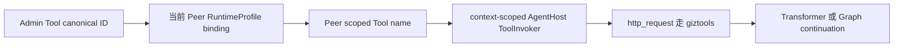

# Tools

[Go API Reference](https://pkg.go.dev/github.com/GizClaw/gizclaw-go/pkgs/gizclaw/services/runtime/toolkit)

`toolkit` 负责 typed Tool Resource 的持久化、公共校验、防御性快照与
canonical-ID policy 过滤。Admin Tool resource 使用 caller-supplied、immutable
`metadata.id`；运行时执行名是显式的 immutable `spec.invoke_name`，不是第二个
Admin identity。RuntimeProfile binding 与 Admin `ToolkitPolicy.tool_ids` 保存
canonical ID。Peer RPC 把 binding key 投影为 scoped Tool `name`；Peer Toolkit
policy 按 [Workspace 选择规则](./peerresource) 解析 scoped name 或已绑定工具的
`invoke_name`，不暴露 canonical ID；执行调用使用 Tool 的 `invoke_name`。已存
Workspace 选择在 binding 移除后仍保留可读取的调用名投影；不可读取或有 alias
冲突的项被跳过，不能影响 Workspace 操作成功。全部项不可表示时返回空列表，
现有 Schema 无法在该响应中区别失效引用与显式禁用；已存 ID 不变，投影列表不是
无损备份。模型实际可用的工具由下文“暴露策略”决定。

目前支持一种 Tool：

- `http_request` 声明一个固定 HTTPS `GET` 或 JSON `POST` 操作。参数通过
  RFC 6901 pointer 映射到 query 或 body field；status、response pointer、
  timeout 与 response size 都由 Resource 固定。

Resource contract 中不存在 `source`、`builtin`、executor registry、第二套 Tool
identity、`output_schema` 或 provider ToolCall ID。

## 暴露策略

Tool 只能由 Workflow 显式开启。RuntimeProfile `resources.tools` binding 只决定
当前 Peer 能使用哪些 Tool，不会自动交给任何 Workflow。

- Workflow `spec.toolkit.tool_ids` 是该 Workflow 可用 canonical ID 的完整列表。
  省略 `spec.toolkit`、省略 `tool_ids` 与 `tool_ids: []` 等价，都不提供任何工具。
- Workspace `toolkit.tool_ids` 只与 Workflow 列表取交集，不能加入 Workflow 未列出
  的工具。省略时不再收窄，显式空数组禁用全部工具。Peer 按名称选择的规则见
  [Workspace 选择规则](./peerresource)。
- 每次调用时，结果再与当前 Peer RuntimeProfile binding 取交集。列出但未被 Profile
  绑定的 ID 只是不可用，不会报错。
- 交集为空时 AgentHost 不创建 ToolInvoker，Transformer 调用模型时不携带工具声明，
  也不读取 Tool Resource。

标准 Giztest RuntimeProfile 绑定 `09-giztest/00-toolkit-tools.yaml` 中只用于声明的
`giztest_echo` 与 `giztest_other`，它们的 host 是保留的 `.invalid`，不会被真正调用。
`server.workspace.toolkit.exposure.giztest.yaml` 让真实模型只列出声明给它的工具名、
不做调用；工具名不出现在任何 prompt 中，只能来自声明。该文档覆盖 Workflow 省略策略、
完整列表、Workspace 收窄和 Workspace 无法放大四种组合。

## HTTP auth 与 transport

HTTP auth 是封闭 union：`none`、`bearer`、`header_api_key`、`volc_ark`、
`volc_search`、`volc_openapi`、`aliyun_app_code`、
`aliyun_openapi_v3`。Bearer token 与 header API key 是 write-only Resource
field：同一方法更新时省略 secret 会保留，提供新值会轮换，切换方法会删除旧
secret。Admin read、RuntimeProfile projection、model definition、日志与结果都
不会返回这些值。

Provider auth 在每次调用时解析一个 `volc` 或 `aliyun` Credential。Volc
Ark/Search 使用固定 API-key field；Volc OpenAPI 与阿里云 OpenAPI V3 对最终
request 签名；阿里云市场使用 AppCode。`pkgs/giztools` 只包含有界 HTTP request
mapper/executor；它不解析 Resource、policy、RuntimeProfile，
不选择 Peer，也不实现 `genx.ToolInvoker`。

HTTP 仅允许 HTTPS，关闭 redirect 与环境 proxy；每次连接都检查全部 DNS 结果，
拒绝 private、loopback、link-local、multicast、unspecified、运营商 NAT 与
Server 配置的 denied network；同时校验 JSON status、content type、大小、语法和
response pointer。执行不会自动重试。

## Runtime 链路

```mermaid
flowchart LR
    Resource["Admin Tool canonical ID"] --> Profile["当前 Peer RuntimeProfile binding"]
    Profile --> Policy["Peer scoped Tool name"]
    Policy --> Invoker["context-scoped AgentHost ToolInvoker"]
    Invoker --> HTTP["http_request 走 giztools"]
    HTTP --> Continue["Transformer 或 Graph continuation"]
```

Disabled Tool 不会被声明；dangling Resource 或同一 canonical ID 的重复 binding
会使 scope 构造失败。每次调用都会重新读取 Resource、重新授权、校验 model
arguments，再严格按 `spec.type` 分发；不会回退到另一类型、name、owner Profile
或其他在线 Peer。

HTTP 的 `timeout` 与 `unavailable` 会成为有界 JSON Tool result，交回模型继续
执行；原始 transport 与 Credential 信息会被隐藏。ToolCall 与
ToolResult 始终是 Transformer/Graph 内部控制，不会作为 public assistant stream
control message 发给 Peer。

Tool catalog 使用 `tools` SQL 业务表：canonical ID 为主键，`invoke_name` 有唯一约束，类型、启用状态、描述、版本与时间为独立列；输入 Schema、trigger、metadata 和 HTTP 配置分别保留为 JSON。Server 启动时初始化表并复用 SQL 连接池，按调用名获取工具只执行一次索引查询。目录枚举按 ID 分批查询，每批最多 256 条。更新使用行版本和创建实例标识进行条件写入；并发轮换密钥或删除后重建时，重读当前记录再处理省略的密钥，不恢复旧密钥。
