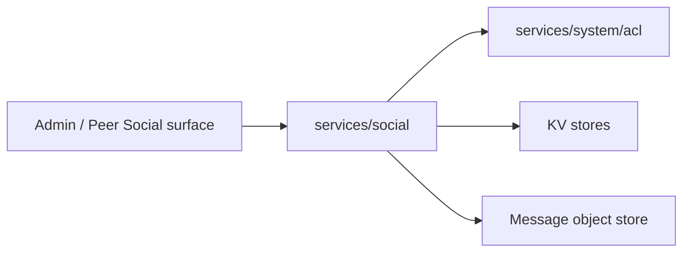

# services/social

`pkgs/gizclaw/services/social` 拥有 GizClaw 的 social graph，包括联系人、好友关系和 friend group。每个子 package 负责一个清晰的资源边界。

## 目录结构

```text
services/social/
├── contact/       # Contact 资源
├── friend/        # Friend request 和 friend relationship
└── friendgroup/   # Group、member、message 和 message asset
```

## 子目录职责

### contact

拥有 peer 的 contact 资源和 contact lifecycle。Contact 是用户维护的通讯录数据，不等同于已经建立的 friend relationship，也不等同于底层 giznet peer connection。

### friend

拥有 friend request 的创建、接受、拒绝，以及 friend relationship 的读取和删除。它可以使用 ACL 判断权限，但 friend 状态本身属于 social 领域。

每个好友直聊生命周期拥有一个 system Workspace，并在创建、rollback 和关系删除时使用内部 Workspace create/delete 能力。

### friendgroup

拥有 friend group、member、message、invite 和 message asset。Group membership 与 ACL role 是不同层面的关系；不能用其中一个隐式替代另一个。

每个 Friend Group 生命周期拥有一个 system Workspace，并在创建、rollback 和群组删除时使用内部 Workspace create/delete 能力。

## 依赖与边界



应该放在 `services/social`：

- Contact、friend request、friend relationship、group、member 和 message 的领域行为。
- Social resource 的 validation、storage 和 cleanup。

不应该放在这里：

- Giznet peer connection 或 signaling contact。
- ACL role、policy binding 和通用 authorization engine。
- Chat Agent、workspace runtime 或通用 messaging transport。
- Admin/Peer route registration。

新增 social 能力时，应先判断它属于 contact、friend 还是 friend group；只有形成新的独立资源与生命周期时才增加新的子 package。
