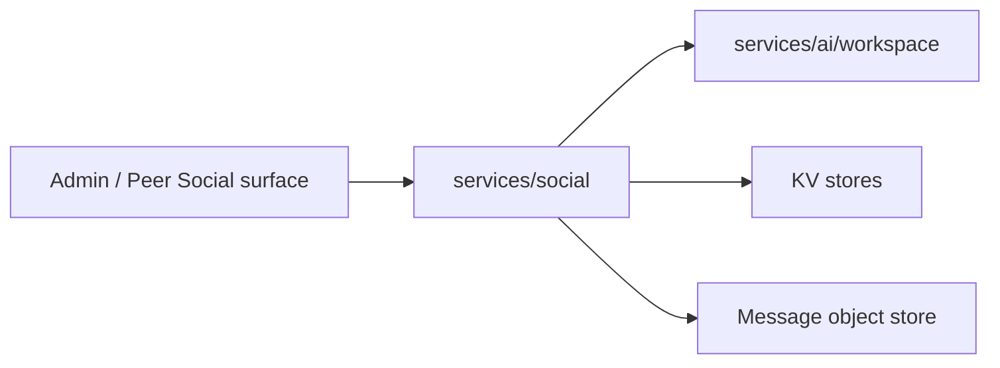

# services/social

`pkgs/gizclaw/services/social` 拥有 GizClaw 的 social graph，包括联系人、好友关系和 friend group。每个子 package 负责一个清晰的资源边界。

## 目录结构

```text
services/social/
├── contact/       # Contact 资源
├── friend/        # Friend request 和 friend relationship
└── friendgroup/   # Group、member、message 和 message asset
```

## 子目录职责

### contact

拥有 peer 的 contact 资源和 contact lifecycle。Contact 是用户维护的通讯录数据，不等同于已经建立的 friend relationship，也不等同于底层 giznet peer connection。

### friend

拥有 friend request 的创建、接受、拒绝，以及 friend relationship 的读取和删除。Friend 关系直接决定双方对 system Workspace 的访问，不创建通用访问 role。

每个好友直聊生命周期拥有一个独立的 system Workspace。稳定 `RelationID` 只标识双方；每次从无关系进入 active 状态时，服务创建新的 opaque incarnation，并从 `(RelationID, incarnation)` 派生新的 Workspace name。持久化 creation intent 固定本次 incarnation、Workspace owner、Workspace name 和 owner RuntimeProfile `workflows.system.friend_chatroom` 选择的 Chatroom Workflow；Workspace 创建与双方 relationship 提交之间发生失败时，重试或启动恢复会复用同一 intent，不会产生第二个 identity。每个 incarnation 还保留一个不可变 decision，通过原子竞争只允许“提交双方 relationship”或“取消创建”其中一方获胜，因此共享 relationship store 的两个服务实例不能同时提交这两个状态。如果 intent 尚未提交 relationship 时收到删除请求，服务会记录 cancellation decision 并删除从未 active 的 Workspace；延迟的创建方竞争失败后也会再次执行这次幂等清理，启动恢复不会重新建立这段关系。所有清理都只在 pair 当前 creation intent 的存储 incarnation 仍匹配时执行原子 compare-and-delete，因此旧生命周期的延迟工作不能移除重新加好友产生的新恢复意图。

Friend relationship 行保存本次生命周期的精确 Workspace name。正式删除好友时，服务在同一个 KV `BatchMutate` 中原子删除双方 relationship 并保存最小 retirement intent，提交成功后才把该精确 Workspace 置入 `PendingDeletion`；完成后用 compact retirement receipt 保留幂等重试所需的 identity。重新加好友始终创建新的 Workspace，不查询、清除或复用旧 Workspace 的 `PendingDeletion`、清理任务、runtime、history 或 artifact。缺少 `workspace_name` 的旧 relationship 行才回退到 pair-only legacy name。创建 invite token 的 Peer 是发起人和不可变 Workspace owner；接受邀请的一方获得访问权但不共享 ownership，Admin 创建使用显式 owner。

### friendgroup

拥有 friend group、member、message、invite 和 message asset。Group membership 直接决定成员对 group system Workspace 的访问。

每个 Friend Group 生命周期拥有一个 system Workspace。创建 rollback 可以立即删除未投入使用的 Workspace；正式删除群组时先在一个共享 relationship store transaction 中原子删除 Group、invite、member 与 belongs 记录并保存 retirement intent。提交成功后，服务先创建一条包含 message store 与 message asset locator 的 Friend Group 数据 `PendingDeletion`，再把 Workspace 放入它自己的 `PendingDeletion`。消息、history、runtime 与 artifact 都保持物理完整，由各自 ownership 的异步 cleaner 处理。Peer 创建的群归创建者所有；Admin 创建必须显式给出 owner。成员身份只授予数据访问，不改变 ownership。服务从 owner RuntimeProfile 的 `workflows.system.group_chatroom` 选择真实 Chatroom Workflow。

relationship 提交与 Workspace retirement 分成两个可重试阶段：第一阶段失败时
relationship 与 Workspace 都保持可用；第二阶段失败时保留 retirement intent，
重试同一删除请求只补做相同 Workspace 的 `PendingDeletion`，不会恢复或重复删除
relationship。只有两个阶段都达到成功 contract 后才发送关系失效 Peer Event。

已 active 的 Chatroom 撤权后不自动切换 Workspace。每个新 turn 都在转发、ASR、
model 和 history 之前检查权威 relationship；非法 turn 不持久化，返回同一
`stream_id` 的 typed EOS error。Workspace listing、普通 Get/history 和新的显式
选择继续按 relationship 与 PendingDeletion 拒绝访问。

## 依赖与边界


```mermaid
flowchart LR
    Surface["Admin / Peer Social surface"] --> Social["services/social"]
    Social --> Workspace["services/ai/workspace"]
    Social --> KV["KV stores"]
    Social --> Assets["Message object store"]
```

应该放在 `services/social`：

- Contact、friend request、friend relationship、group、member 和 message 的领域行为。
- Social resource 的 validation、storage 和 cleanup。

不应该放在这里：

- Giznet peer connection 或 signaling contact。
- RuntimeProfile 持久化、owner index 或通用注册逻辑。Social 只在写入领域状态前解析 owner 当前 profile，以选择已配置的 system Workflow。
- Chat Agent、workspace runtime 或通用 messaging transport。
- Admin/Peer route registration。

新增 social 能力时，应先判断它属于 contact、friend 还是 friend group；只有形成新的独立资源与生命周期时才增加新的子 package。
