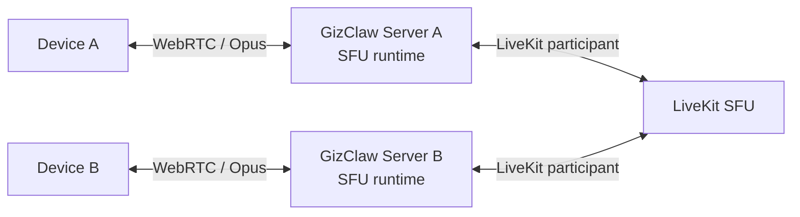
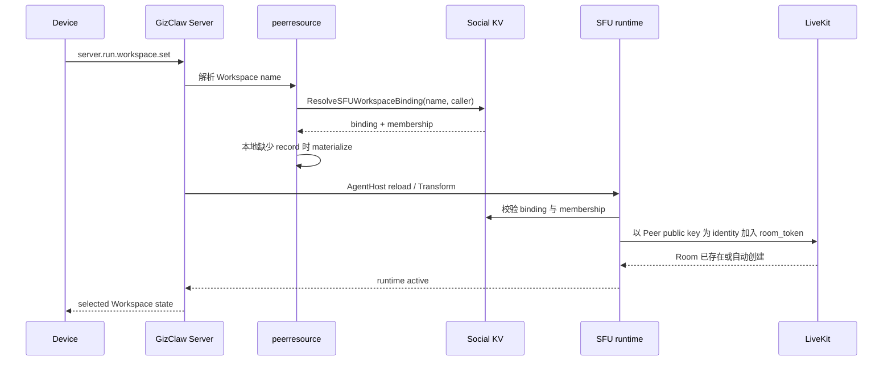
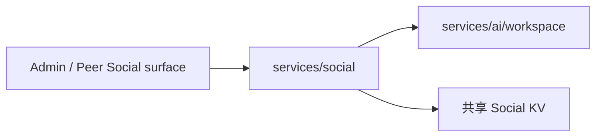

# services/social

`pkgs/gizclaw/services/social` 拥有 GizClaw 的 social graph，包括联系人、好友关系和 friend group。每个子 package 负责一个清晰的资源边界。

## 目录结构

```text
services/social/
├── contact/       # Contact 资源
├── friend/        # Friend request 和 friend relationship
└── friendgroup/   # Group、member、invite 和 Workspace/SFU binding
```

## 子目录职责

### contact

拥有 peer 的 contact 资源和 contact lifecycle。Contact 是用户维护的通讯录数据，不等同于已经建立的 friend relationship，也不等同于底层 giznet peer connection。

### friend

拥有 friend request 的创建、接受、拒绝，以及 friend relationship 的读取和删除。Friend 关系直接决定双方对 system Workspace 的访问，不创建通用访问 role。

Peer RPC 以 `name` 暴露 Friend relationship 的稳定身份，其值是已由 authenticated caller 限定 scope 的另一方 Peer public key；get/info/delete 接收同一个 `name`。Profile 展示字段是 `FriendInfo.display_name`。确定性的 relationship ID 只保留在内部以及 Admin/persistence surface。

每个好友直聊生命周期拥有一个独立的 system Workspace。稳定 `RelationID` 只标识双方；每次从无关系进入 active 状态时，服务创建新的 opaque incarnation，并从 `(RelationID, incarnation)` 派生新的 Workspace name。持久化 creation intent 固定本次 incarnation、Workspace owner、Workspace name 和本次 incarnation 的 SFU `room_token`；Workspace 固定绑定内置 `system-sfu` Workflow，不从 RuntimeProfile 选择；Workspace 创建与双方 relationship 提交之间发生失败时，重试或启动恢复会复用同一 intent，不会产生第二个 identity。每个 incarnation 还保留一个不可变 decision，通过原子竞争只允许“提交双方 relationship”或“取消创建”其中一方获胜，因此共享 relationship store 的两个服务实例不能同时提交这两个状态。如果 intent 尚未提交 relationship 时收到删除请求，服务会记录 cancellation decision 并删除从未 active 的 Workspace；延迟的创建方竞争失败后也会再次执行这次幂等清理，启动恢复不会重新建立这段关系。所有清理都只在 pair 当前 creation intent 的存储 incarnation 仍匹配时执行原子 compare-and-delete，因此旧生命周期的延迟工作不能移除重新加好友产生的新恢复意图。

Friend relationship 行保存 Peer 可见的精确 Workspace name，内部 binding `friend-workspace-bindings/<relationID>` 则保存用于 retirement、`PendingDeletion`、runtime 与 asset cleanup 的 canonical Workspace ID，以及双方共享的 [SFU binding](#sfu-workspace)。正式删除好友时，服务在同一个 KV `BatchMutate` 中原子删除双方 relationship 并保存最小的 ID-based retirement intent，提交成功后才进入清理队列；完成后用 compact retirement receipt 保留幂等重试所需的 canonical identity 与不可变 name。重新加好友始终创建新的 Workspace 和新的 `room_token`，不查询、清除或复用旧 Workspace 的清理状态。Relationship 或 binding 缺少最终 Schema 要求的 identity 字段时视为无效，不提供旧 identity fallback。创建 invite token 的 Peer 是发起人和不可变 Workspace owner；接受邀请的一方获得访问权但不共享 ownership，Admin 创建使用显式 owner。

Friend invite token 是不透明且区分每个字节的 credential。`friend.add` 只把空值或纯空白值视为缺少参数；其他输入不会做 trim 或格式校验，只有与当前有效 token 完全相等才可建立关系。未知、格式任意、带首尾空白、已清除或已过期的 token 统一返回 not found，调用方自己的 token 返回 conflict。存储读取、解码、有效记录校验或过期记录清理失败统一返回脱敏的 internal error；所有拒绝都不会创建 Friend relationship 或 Workspace，也不会关闭底层 Peer connection。

### friendgroup

拥有 friend group、member、invite 以及权威的 canonical `friend_group_id -> workspace_id` 绑定。Admin 始终用 canonical ID 定位 Group；Peer RPC 只接受当前成员自己的本地 Group `name`，服务在 owner/member scope 内把该 name 解析为 canonical ID。不同 Peer 可以为同一 Group 使用不同 name，也可以为各自资源复用相同 name。Group membership 直接决定成员对 group system Workspace 的访问。

每个 Friend Group 生命周期拥有一个 system Workspace。创建 rollback 可以立即删除未投入使用的 Workspace；正式删除群组时先在一个共享 relationship store transaction 中原子删除 Group、invite、member 与 belongs 记录并保存 retirement intent。提交成功后，服务先创建一条 Friend Group 数据 `PendingDeletion`，再把 Workspace 放入它自己的 `PendingDeletion`。runtime 与 artifact 保持物理完整，由各自 ownership 的异步 cleaner 处理。Peer 创建的群归创建者所有；Admin 创建必须显式给出 owner。成员身份只授予 Workspace 访问，不改变 ownership。Workspace 固定绑定内置 `system-sfu` Workflow；Group 的 SFU binding 保存在 `social-workspace-bindings/friend-groups/<groupID>`，随 Group record 的 `CreateIfAbsent` 一起提交。

Peer membership object 以 `friend_group_name` scope 内的 `name` 作为身份；Admin membership object 继续同时保留 canonical `id` 与 scoped `name`。Friend Group 成员上限固定为 10 人（含 owner），由 `socialutil.FriendGroupMemberLimit` 写死，不通过 RuntimeProfile 或配置调整。`friend_group.join`、`members.add` 与 Admin 创建成员在成员数已达上限时返回 `409 Conflict` 与错误码 `FRIEND_GROUP_FULL`，不消费 invite token。Friend Group 不拥有消息、History、音频 store、独立 TTL 或清理循环。

relationship 提交与 Workspace retirement 分成两个可重试阶段：第一阶段失败时
relationship 与 Workspace 都保持可用；第二阶段失败时保留 retirement intent，
重试同一删除请求只补做相同 Workspace 的 `PendingDeletion`，不会恢复或重复删除
relationship。只有两个阶段都达到成功 contract 后才发送关系失效 Peer Event。

删除好友、删除群组和移除成员都在提交后同步撤销受影响 Peer 的 SFU runtime，见
[撤权](#撤权)。Workspace listing、普通 Get 和新的显式选择继续按 relationship 与
PendingDeletion 拒绝访问。

## 多 Server 边界

Friend、Friend Group 与 Peer Store 通过共享 KV backend（multi-server 部署使用同一个 Redis）成为 source of truth，因此 invite token、relationship、membership 与 SFU binding 对所有 Server 可见。Workspace、Workflow 与 RuntimeProfile catalog 仍是 Server 本地。跨 Server 加好友与跨 Server 加群都是受支持的操作：创建与成员变更路径不比较 Peer 的固定 Server assignment，`PeerAssignments` 只用于 Peer 归属路由与 Peer Event 投递。

多 Server 只共享逻辑身份，不共享进程内对象：

| 全局一致（共享 Social KV） | Server 本地 |
| --- | --- |
| Friend/Group lifecycle 与 membership | 在线 Peer connection |
| Workspace identity（ID、name、owner） | 本地 Workspace record 与 SFU runtime |
| SFU `url`、`room_token`、`generation` | LiveKit participant connection |

每台可能承载成员连接的 Server 都能只依赖共享 Social KV 和本地 `sfu` driver 激活同一个 Workspace，不需要回调某个 owner Server。本地 Workspace record 的按需 materialize 见[多 Server materialize](#多-server-materialize)。

## SFU Workspace

Friend 与 Friend Group 的实时语音运行在同一种 SFU Workspace 上：Social resource 拥有一个逻辑 Workspace，在线 Peer 通过 `server.run.workspace.set` 选择它后，GizClaw Server 把该 Peer 的 GenX 音频流桥接到 Social resource 声明的 SFU Room。Device 只保持已有的 WebRTC connection，不连接也不感知 LiveKit；Edge 只转发既有 Giznet connection。


```mermaid
flowchart LR
    A["Device A"] <-->|"WebRTC / Opus"| SA["GizClaw Server A<br/>SFU runtime"]
    B["Device B"] <-->|"WebRTC / Opus"| SB["GizClaw Server B<br/>SFU runtime"]
    SA <-->|"LiveKit participant"| LK["LiveKit SFU"]
    SB <-->|"LiveKit participant"| LK
```

### 资源模型

每个 Friend relationship incarnation 和每个 Friend Group lifecycle 拥有一个 system Workspace：

```yaml
id: <workspace_id>
name: <workspace_name>
workflow: system-sfu
parameters: null
system: true
owner_public_key: <发起方或 Group owner>
```

`system-sfu` 是内置 system Workflow：driver 为 `sfu`，payload 为空对象，由 `services/ai/workflow` 的 `EnsureBuiltinWorkflows` 在每台 Server 启动时幂等 materialize。Admin 对它的 create、put、delete 分别返回 `409`、`400`、`404` 与错误码 `WORKFLOW_BUILTIN`，Workflow list 不显示它。`sfu` 不属于 `ReusableWorkflowDriver`，Pet 不能嵌套它。

SFU Workspace 是空的运行入口，不拥有 Workspace History、Message、media asset、Agent memory 或任何可配置项；通用 Workspace put 不能修改它。History RPC 对它返回空结果，它不发送 `workspace_history_updated`，不参与 Gameplay Workspace Reward，也不能绑定 OpenAI Conversation。

### Binding

Friend 与 Friend Group 各自在共享 Social KV 中保存一份 SFU binding，结构为 `socialutil.SFUBinding`：

```yaml
sfu:
  url: wss://sfu.internal      # 取自本 Server 的 services.sfu.url
  room_token: room-<random>    # 创建时随机生成的公开 Room identity
  generation: 1                # 每次 binding 替换时递增
```

| Social resource | KV key | 提交时机 |
| --- | --- | --- |
| Friend | `friend-workspace-bindings/<relationID>` | 随 creation intent 一起 mint `room_token`，与双方 relationship 同一 `BatchMutate` 提交 |
| Friend Group | `social-workspace-bindings/friend-groups/<groupID>` | 随 Group record 的 `CreateIfAbsent` 一起提交 |

`room_token` 是公开、稳定的 Room identity，不是 LiveKit credential；相同 Social lifecycle 的所有 Server 使用同一个 `url + room_token`。方向性 Friend row 不复制 SFU 字段。Friend Group 的 `room_token` 不从 group ID 派生；添加或删除普通成员不改变 Workspace identity、`room_token` 和 `generation`，其余成员的 Room 不受影响。Server 未配置 `services.sfu` 时，创建 Friend 或 Friend Group 返回 `ErrSFUNotConfigured`。

创建 Social resource 不调用 LiveKit 创建 Room。首个 participant 加入时 LiveKit 以 `room_token` 为名自动创建 Room，最后一个 participant 离开后由 LiveKit 自行销毁；Social resource 与 Workspace identity 继续存在，下次激活时重新创建。

### 激活流程


```mermaid
sequenceDiagram
    participant D as Device
    participant S as GizClaw Server
    participant R as peerresource
    participant K as Social KV
    participant W as SFU runtime
    participant L as LiveKit

    D->>S: server.run.workspace.set
    S->>R: 解析 Workspace name
    R->>K: ResolveSFUWorkspaceBinding(name, caller)
    K-->>R: binding + membership
    R->>R: 本地缺少 record 时 materialize
    S->>W: AgentHost reload / Transform
    W->>K: 校验 binding 与 membership
    W->>L: 以 Peer public key 为 identity 加入 room_token
    L-->>W: Room 已存在或自动创建
    W-->>S: runtime active
    S-->>D: selected Workspace state
```

SFU attach 前必须从权威 Social KV 校验：Friend 当前 incarnation 仍为 active 且 caller 是关系成员；Friend Group 仍存在且 caller 是当前成员；Workspace identity 与 binding 完全匹配；resource 没有进入 retirement。`Manager` 先查询 Friend binding，再查询 Friend Group binding；两者都不拥有该 Workspace 时返回 `sfu.ErrNotBound`。

每个 Peer 使用自己的 public key 作为唯一 LiveKit participant identity。同一个 Peer 同一时刻只允许一个 participant：Peer 在另一台 Server 重新激活时以相同 identity 加入，LiveKit 踢掉旧 participant，旧 runtime 收到 `DuplicateIdentity` 后视为正常终止，不重连。`server.run.workspace.set` 切换 Workspace 时先取消旧 runtime 再激活新 runtime；Peer 断开、Workspace retirement 与 Server shutdown 使用同一关闭路径。

Peer 入站 Opus packet 与 BOS/EOS 只在当前 active runtime 是已 attach 的 SFU runtime 时才进入 GenX input；runtime 未 attach、已撤权或无法校验时，Server 用同一 `stream_id` 的 typed EOS 拒绝，错误码见 [Events](/references/events)。connector 行为见 [SFU 组合边界](/zh/developing/gizclaw/services/ai#sfu-组合边界)。

### 撤权

下列变化会终止已经建立的 SFU participant：

- 删除好友关系（`friend.delete`）。
- 删除 Friend Group（`friend_group.delete`）。
- 从 Friend Group 移除成员（`members.delete`、Peer 退休）。

Social 服务在一个 `BatchMutate` 中提交关系变化（binding 被替换时同时递增 `generation`），不向任何 Peer 或 Server 推送取消信号。终止由 SFU runtime 自己完成：它按 `services.sfu.recheck_interval` 周期重读共享 Social KV 中的 binding，成员不再有效、generation 不匹配或 resolver 出错时立即 fail closed，断开 participant 并结束 session。本机与异机 Peer 行为一致，撤权是最终一致的，停止转发的延迟上限为一个 recheck 周期。新的发言不受这个延迟影响：每个入站 BOS 与 Opus packet 都会按 Peer 校验成员身份，失败以 typed EOS 拒绝且不缓存音频。Workspace deletion cleaner 的异步 quiesce 继续负责最终释放。

### 多 Server materialize

Workspace catalog 是 Server 本地的，因此 `peerresource` 在解析 Workspace name 时，如果共享 Social KV 为 caller 绑定了该 name 而本地没有 record，会用 binding 中的 `WorkspaceID`、`WorkspaceName`、`Owner` 和 `system-sfu` Workflow 调用 `CreateSystemWorkspace` 创建本地副本。所有 Server 的副本具有相同 identity、driver 与 binding，不各自生成 Room identity，也不独立决定生命周期。Social SFU Workspace 永远不按 owner 授权，只按 membership 授权；这也是唯一允许 restricted reload 的非 owner Workspace 类型。

### 配置

LiveKit URL、API Key 与 API Secret 是 Server 级单一配置，位于 `services.sfu`（见 [Server 配置](/zh/developing/gizclaw/server/main)）：

```yaml
services:
  sfu:
    url: wss://sfu.internal
    api_key_file: /etc/gizclaw/sfu/api_key
    api_secret_file: /etc/gizclaw/sfu/api_secret
    recheck_interval: 5s      # 可选，默认 5s
    reconnect_timeout: 30s    # 可选，默认 30s
```

credential 只通过文件在启动时读取，不进入 Social KV、Workspace、Peer API、Event、日志或生成 SDK；不在 RuntimeProfile、Workspace 或 Admin API 中按 profile 区分 SFU。省略整个 block 会禁用本 Server 的 SFU Workspace。

### 限制

- Friend Group 成员上限 10 人（含 owner），超出返回 `FRIEND_GROUP_FULL`。
- 每个 Peer 同一时刻只有一个 participant；同一 Server 上每个 Workspace 只有一个共享 Agent。
- 不提供语音留言、历史消息、录音下载或历史播放。
- 不在 Workspace 中配置 PTT、realtime、ASR、transcript、model 或 memory；PTT 与连续输入走同一条 publish 路径。
- 单机 LiveKit 重启会中断进行中的通话；runtime 在 `reconnect_timeout` 内有界重连，不承诺无损故障转移。

## 依赖与边界


```mermaid
flowchart LR
    Surface["Admin / Peer Social surface"] --> Social["services/social"]
    Social --> Workspace["services/ai/workspace"]
    Social --> KV["共享 Social KV"]
```

应该放在 `services/social`：

- Contact、friend request、friend relationship、group、member 和 group-to-Workspace resolution 的领域行为。
- Social relationship resource 的 validation、storage 和 cleanup。

不应该放在这里：

- Giznet peer connection 或 signaling contact。
- RuntimeProfile 持久化、owner index 或通用注册逻辑。
- SFU connector、workspace runtime 或通用 messaging transport。
- Admin/Peer route registration。

新增 social 能力时，应先判断它属于 contact、friend 还是 friend group；只有形成新的独立资源与生命周期时才增加新的子 package。

Contact mutation 与 retirement 按 owner 协调。Friend retirement 快照只持有目标 Peer admission gate，双向关系变化仍按 relation key 串行。Friend Group 快照使用相同的目标 Peer admission 边界；删除群时按 canonical 顺序获取 owner/全部 member Peer 集合及 group lock。退休扫描不会停止与目标 Peer 无关的关系或群。
