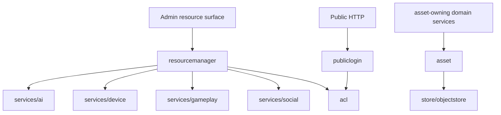

# services/system

`pkgs/gizclaw/services/system` 提供多个产品领域共同依赖的系统级服务，包括 asset lifecycle、访问控制、public login 和 declarative resource 管理。

## 目录结构

```text
services/system/
├── asset/             # 共享 immutable asset Ref、metadata 和 binary lifecycle
├── acl/               # Role、policy binding、ACL view 和授权判断
├── publiclogin/       # Public HTTP login、assertion 和 session
└── resourcemanager/   # Admin declarative resource 的统一入口
```

## 子目录职责

### asset

提供由业务服务注入使用的共享 AssetService。它用 metadata KV 和一个逻辑 ObjectStore 管理 canonical immutable Ref、media type、size、SHA-256、TTL，以及流式 Put、Open、Delete 和显式 Reconcile。

AssetService 不拥有 owner、binding、reference count、Resource schema、authorization 或 HTTP/RPC transport。调用 Put 的业务服务拥有返回 Ref 的引用完整性和删除策略：业务提交失败时清理新 Ref，业务对象替换或删除后再按自己的共享与 retention 规则删除旧 Ref。AssetService 不反查业务对象，也不判断一个 Ref 是否仍被引用。

需要保存 product asset 的领域服务依赖同一个 AssetService，而不是各自依赖和配置 physical ObjectStore。领域服务继续负责 PNG、PIXA、TAR、Opus 等格式校验、业务 metadata、public endpoint 和 caller authorization。

### acl

拥有 GizClaw 的 role、policy binding、ACL view、subject/resource permission 和授权判断。其他领域可以询问 ACL，但不能在各自 package 中建立互相冲突的第二套通用权限模型。

ACL 不负责 transport peer 是否能打开 giznet service；transport-level policy 与 product resource authorization 是不同边界。

### publiclogin

负责 public HTTP caller 使用 GizClaw identity 完成登录并取得 session。它连接 public HTTP identity 与 Server session，但不拥有 browser route、Edge proxy 或业务资源权限。

最终资源授权仍由 ACL 和对应领域服务执行。登录成功不等于拥有所有资源访问权限。

### resourcemanager

为 Admin apply、show 和通用 resource 操作提供统一的 declarative resource dispatch。它知道不同 resource kind 应交给哪个领域服务，但不重新实现 credential、workflow、firmware、gameplay 或 social 的业务规则。

ResourceManager 是跨领域协调层，不是所有 GizClaw resource 的实际 owner。

## 依赖与边界



应该放在 `services/system`：

- 跨领域统一使用的 product authorization 和 session 能力。
- 由业务服务单向依赖的共享 immutable asset storage lifecycle。
- Declarative resource 的跨领域 dispatch 与公共管理边界。
- System-owned migration、validation 和持久化规则。

不应该放在这里：

- 各领域资源自己的业务实现。
- Asset 的业务 owner、引用关系、格式、授权或 public transport。
- Giznet transport security policy 或 WebRTC signaling crypto。
- Edge proxy token forwarding。
- CLI config、storage backend 创建和进程生命周期。
- 为了避免选择领域 ownership 而放入的通用 helper。
