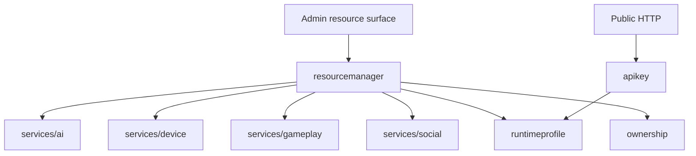

# services/system

`pkgs/gizclaw/services/system` 提供多个产品领域共同依赖的系统级服务，包括 RuntimeProfile、设备注册、API Key、resource ownership 和 declarative resource 管理。

## 目录结构

```text
services/system/
├── ownership/         # owner context、owner index key 和写入规则
├── pendingdeletion/   # durable pending-deletion task 与 managed processor
├── apikey/            # 设备绑定 API Key 的创建、鉴权与清理
├── resourcemanager/   # Admin declarative resource 的统一入口
└── runtimeprofile/    # RuntimeProfile 与 RegistrationToken
```

## 子目录职责

### ownership

提供 persisted resource 使用的 owner context 与 KV index 约定。在 Peer surface 上，Workspace 是用户创建状态；真实 Model、Credential、Workflow 和 Tool 只能由 Admin 修改。Friend、FriendGroup 和 Pet 的 system Workspace 由各自领域关系补充可见性。

### pendingdeletion

定义带版本的 backend-neutral `PendingDeletion` envelope，以及 durable task/source contract、registration、有界 scan 与 worker、lease、replay phase、持久化 retry state 和 operator list/get/retry service。领域删除请求在资源自己的物理存储中原子创建或复用一条最小 cleanup descriptor，同时保留 active resource 与 index。locator 派生的稳定 ID 让 producer retry 命中同一事件；immutable marker fingerprint 则阻止早期 generation 或 stale lease 修改后续 work。

公共 processor 不包含任何资源删除 policy，也不会在 handler 返回后执行 generic complete。领域 handler 必须重新验证 marker、当前 lease 与准确 resource generation，然后在一个领域原子边界内删除资源及 source-owned marker、locator 和 task state。Outcome 分为 `deferred`、有界 retryable failure 与 terminal `failed`；operator retry 会保留 replay phase。完成的 task 立即消失，不保留 receipt 或 history。Production registry 包含 `gameplay/pet`、`friend_group/friend_group`、`workspace/workspace` 与 `peer/peer`；任一 source 只声明自己拥有且已注册 handler 的 kind。Peer handler 是跨领域协调者，但实际清理由各领域的 narrow adapter 完成；Peer 最终只在自己的 KV 留下永久 tombstone。

Metrics 使用有界的 source/kind/status/phase/outcome label，报告 active depth、最老 active age、claim、active worker、phase latency、deferral、retry、terminal failure、transition error 与 completion；resource ID、owner、deletion ID、descriptor、fingerprint、lease token 和 error text 都不会成为 label。Metrics store 失败不会停止 cleanup。

### runtimeprofile

拥有 RuntimeProfile 和 RegistrationToken 的 KV 状态、schema validation、确定性 revision、hash 索引和注册解析。它通过安全 alias 投影 Admin 资源，不定义 reader/member role system。完整结构见 [RuntimeProfile 与设备注册](./runtime-profile)。

### apikey

为已注册 Peer 创建长期 Key，只保存 secret 的 SHA-256 digest，强制同 owner 管理，并在 Peer 退役时撤销该 owner 的全部 Key。该 package 不拥有 HTTP routing、Edge proxy 或业务资源实现。

### resourcemanager

为 Admin apply、show 和通用 resource 操作提供统一的 declarative resource dispatch。它知道不同 resource kind 应交给哪个领域服务，但不重新实现 credential、workflow、firmware、gameplay 或 social 的业务规则。

每个具体 Resource 必须携带 caller-supplied `metadata.id`。ResourceManager 以 `(kind, id)` 查找和分发，create 时把该 ID 原样交给领域 service，update 时要求期望 ID 与现有 ID 相同；它不生成 ID、不做 name lookup，也不提供 name-to-ID fallback。下游引用在输入中已经是目标 canonical ID。`ResourceList` 只负责按顺序分发 items，顶层没有 ID。

ResourceManager 是跨领域协调层，不是所有 GizClaw resource 的实际 owner。

## 依赖与边界


```mermaid
flowchart TB
    Admin["Admin resource surface"] --> ResourceManager["resourcemanager"]
    ResourceManager --> AI["services/ai"]
    ResourceManager --> Device["services/device"]
    ResourceManager --> Gameplay["services/gameplay"]
    ResourceManager --> Social["services/social"]
    ResourceManager --> Profile["runtimeprofile"]
    ResourceManager --> Ownership["ownership"]
    Public["Public HTTP"] --> APIKey["apikey"]
    APIKey --> Profile
```

应该放在 `services/system`：

- 跨领域统一使用的 product authorization 能力。
- Declarative resource 的跨领域 dispatch 与公共管理边界。
- System-owned migration、validation 和持久化规则。

不应该放在这里：

- 各领域资源自己的业务实现。
- Giznet transport security policy 或 WebRTC signaling crypto。
- Edge proxy token forwarding。
- CLI config、storage backend 创建和进程生命周期。
- 为了避免选择领域 ownership 而放入的通用 helper。
