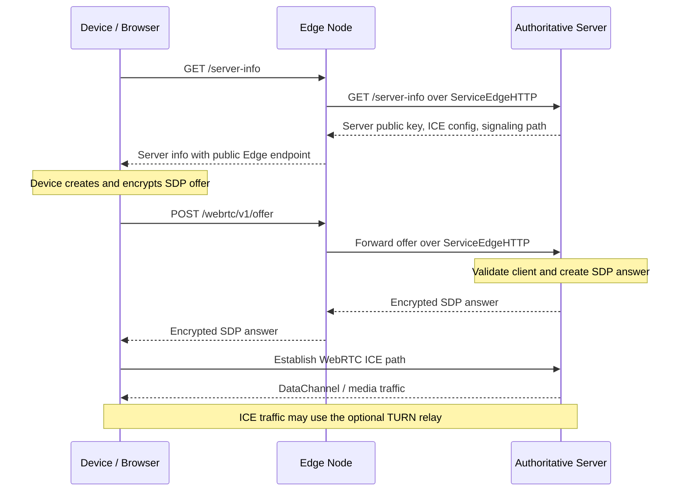
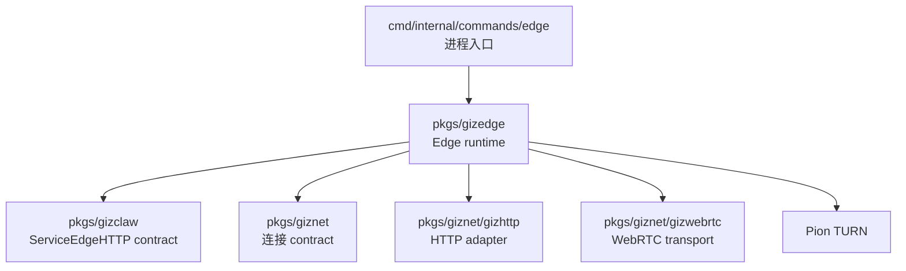

# pkgs/gizedge

`pkgs/gizedge` 提供 GizClaw 的 Edge Node ingress runtime。它在公网接收 browser 或 device 的 HTTP 请求，通过 `giznet` WebRTC connection 将请求转发到配置的 authoritative GizClaw Server。

Edge Node 是入口和转发节点，不是业务数据的 owner。身份验证、最终授权、领域服务和资源存储仍由上游 GizClaw Server 负责。

[Go API References](https://pkg.go.dev/github.com/GizClaw/gizclaw-go@v0.0.0-20260707135347-b9bf1fb24b9f/pkgs/gizedge)

## 目录结构

```text
pkgs/gizedge/
├── config.go    # Edge workspace 配置与边界检查
├── edge.go      # Public ingress、上游连接和请求转发 runtime
└── turn.go      # 可选 TURN server runtime
```

`pkgs/gizedge` 当前是一个扁平 package。这里的代码共同构成单个 Edge Node runtime，还没有需要拆成独立公共子 package 的内部模块。

## Device 连接泳道

Edge Node 启动后已经通过 WebRTC 建立到 authoritative Server 的 giznet connection。Device 再通过 Edge 完成 Server discovery 和 WebRTC signaling：



这条链路中的 ownership 是：

- Device 创建 SDP offer。
- Edge 代理 `/server-info` 和 `/webrtc/v1/offer`，不解析 SDP，也不创建 Device 的 WebRTC PeerConnection。
- Authoritative Server 校验 offer、创建 SDP answer，并拥有最终的 GizClaw peer connection。
- TURN 只在 ICE 无法直连时转发网络流量，不拥有 GizClaw connection 或业务身份。

因此 Edge Node 是 signaling ingress 和可选 relay，不是 Device WebRTC session 的终点。Edge 也不在本地执行 GizClaw domain handler 或建立第二套业务权限模型。

## 目录职责

### Edge 配置

Edge workspace 配置描述当前节点运行所需的基础信息：

- Edge Node 自身的 giznet identity。
- Public HTTP listen address 和对外 endpoint。
- 单个 upstream Server 的 endpoint 与 public key。
- TLS certificate source 的选择。
- 可选 TURN listener、public endpoint、relay address、credential 和 relay port range。

配置属于 Edge runtime，不复用 GizClaw Server 的 storage、service 或 domain 配置。Server config 也不应承担 Edge 进程的 public ingress 和 TURN 参数。

当前 TLS certificate source 只有 disabled 路径可运行；Edge RPC 和 file certificate source 仍未实现。开发指引不能把这些配置值写成已支持能力。

### Public Ingress

Public ingress 负责：

- 监听 Edge Node 的 public HTTP endpoint。
- 将允许的 browser/device API 请求转发给 authoritative Server。
- 为浏览器请求提供 ingress 所需的 CORS 行为。
- 在 server-info response 中发布 Edge Node 对外 endpoint。
- 在进程停止时关闭 HTTP server、上游 connection 和相关 listener。

Edge ingress 不拥有 Peer HTTP、OpenAI-compatible HTTP 或其他 product route 的业务实现。具体 route 由 `pkgs/gizclaw` Server 提供，Edge 只转发公开 surface。

### Upstream Connection

Edge Node 使用 `pkgs/giznet/gizwebrtc` 连接配置的 authoritative Server，并使用 `pkgs/giznet/gizhttp` 在 `ServiceEdgeHTTP` stream 上承载转发请求。

上游连接属于长生命周期 runtime 状态。连接失败后可以重新建立；只有适合安全重试的请求会在重连后自动再次发送。Edge package 不应通过自行复制 GizClaw handler 来规避上游不可用。

### TURN

Edge Node 可以同时运行可选的 TURN UDP relay，为无法直接建立 WebRTC 路径的连接提供 relay 能力。

TURN runtime 只负责 relay listener、认证和 relay port range。它不负责 GizClaw 用户登录、peer ACL、route assignment 或业务授权。TURN credential 与 GizClaw resource credential 也不是同一类数据。

## 依赖关系



依赖方向是：

- CLI command 选择 workspace 并启动 `pkgs/gizedge`。
- `pkgs/gizedge` 消费 GizClaw 定义的 Edge service contract，但不依赖具体领域 service。
- Edge 使用 `giznet`、`gizhttp` 和 `gizwebrtc` 建立上游数据路径。
- `pkgs/gizclaw` 和 `pkgs/giznet` 不依赖 `pkgs/gizedge`。

## Ownership 边界

应该放在 `pkgs/gizedge`：

- Edge workspace 配置和 Edge-specific validation。
- Public ingress listener、proxy 和 Edge response rewrite。
- Edge 到 authoritative Server 的连接、登录、重连和转发生命周期。
- Edge Node 自己运行的 TURN relay。
- 只属于 Edge process 的 shutdown 和 cleanup 行为。

不应该放在 `pkgs/gizedge`：

- Peer、workspace、firmware、gameplay、social 或 Agent 领域服务。
- Authoritative resource storage 和最终 ACL 判断。
- Transport-independent connection contract 或通用 WebRTC 实现。
- GizClaw Server 的 HTTP/RPC handler。
- Server storage backend、migration 和 workspace runtime 组装。
- 全局 peer directory、mesh membership、跨 Server 数据同步或 route replication。

这些内容分别属于 `pkgs/gizclaw`、`pkgs/giznet`、`cmd/internal/server`，或者仍是 server mesh 的后续设计范围。

## 当前边界

当前 `pkgs/gizedge` 实现的是连接单个 authoritative Server 的 experimental Edge HTTP ingress，并可选运行 TURN relay。

它不等同于完整 server mesh：

- Edge Node 当前按配置连接一个 upstream Server。
- `ServiceEdgeHTTP` 已用于 public request forwarding。
- Edge control-plane RPC、certificate distribution 和 TLS certificate source 尚未完整实现。
- Edge Node 不维护 mesh membership 或全局 peer/resource route registry。
- Server 之间不存在由这个 package 提供的数据复制和事件同步。

因此，新增能力时要先判断它是当前 Edge ingress 的职责，还是 server mesh control plane 的未来工作；不能因为能力与公网入口有关就直接写进 `pkgs/gizedge`。
