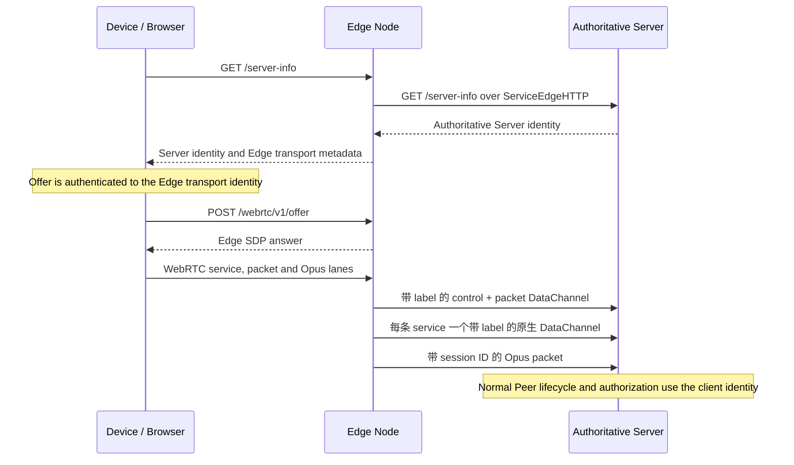
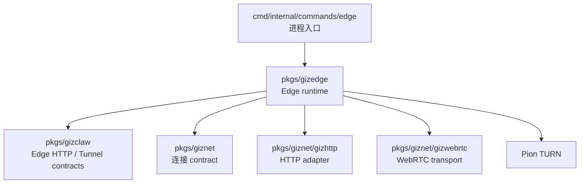

# pkgs/gizedge

`pkgs/gizedge` 提供 GizClaw 的 Edge Node ingress runtime。它在公网接收 browser 或 device 的 HTTP 请求，通过 `giznet` WebRTC connection 将请求转发到配置的 authoritative GizClaw Server。

启用 gateway 后，Edge 也是客户端 WebRTC transport 的终点，并把逻辑连接复用到有界的 Server upstream pool。Edge Node 仍不是业务数据的 owner；客户端 identity、最终授权、领域服务和资源存储均由上游 GizClaw Server 负责。

[Go API References](https://pkg.go.dev/github.com/GizClaw/gizclaw-go@v0.0.0-20260707135347-b9bf1fb24b9f/pkgs/gizedge)

## 目录结构

```text
pkgs/gizedge/
├── config.go     # Edge workspace 配置与边界检查
├── edge.go       # Public ingress、上游连接和请求转发 runtime
├── gateway.go    # Client 终止、逻辑连接与有界 upstream pool
├── upstream_relay.go # 共享的 upstream TURN 选择与健康状态
└── turn.go       # 可选 TURN server runtime
```

`pkgs/gizedge` 当前是一个扁平 package。这里的代码共同构成单个 Edge Node runtime，还没有需要拆成独立公共子 package 的内部模块。

## Device 连接泳道

Edge Node 启动后已经通过 WebRTC 建立到 authoritative Server 的 giznet connection。Device 再通过 Edge 完成 Server discovery 和 WebRTC signaling：


```mermaid
sequenceDiagram
    participant Device as Device / Browser
    participant Edge as Edge Node
    participant Server as Authoritative Server

    Device->>Edge: GET /server-info
    Edge->>Server: GET /server-info over ServiceEdgeHTTP
    Server-->>Edge: Authoritative Server identity
    Edge-->>Device: Server identity and Edge transport metadata

    Note over Device: Offer is authenticated to the Edge transport identity
    Device->>Edge: POST /webrtc/v1/offer
    Edge-->>Device: Edge SDP answer
    Device->>Edge: WebRTC service, packet and Opus lanes
    Edge->>Server: 带 label 的 control + packet DataChannel
    Edge->>Server: 每条 service 一个带 label 的原生 DataChannel
    Edge->>Server: 带 session ID 的 Opus packet
    Note over Server: Normal Peer lifecycle and authorization use the client identity
```

这条链路中的 ownership 是：

- `/server-info.public_key` 始终是 authoritative Server identity；`transport.public_key`、`transport.endpoint` 和 `transport.signaling_path` 只选择本次 Edge WebRTC transport。客户端不能把 transport identity 当作业务 Server identity。
- Edge 校验 signaling 并创建客户端 PeerConnection。在已经认证的 Server PeerConnection 上，Edge 打开 canonical v2 control 与 packet label；control label 单独声明 logical client public key 和有界 remote address，不再发送 delegated body、expiry 或 replay proof。
- Server 只在 physical peer 已激活为 `edge-node` 后注册 v2 namespace，再以声明的 logical client public key 进入正常 Peer lifecycle、service policy 和领域授权。
- 每条可靠 client service 映射到一条带 label 的可靠有序 upstream DataChannel。Direct packet 使用每 session 独立的 unreliable channel；只有 Opus 保留 shared、session-tagged physical packet lane。
- Gateway transport 不把 authoritative Server 的 ICE/TURN server 列表返回给客户端，因此正常 gateway 路径不会为每个客户端创建 Server TURN allocation。

Edge 不在本地执行 GizClaw domain handler，也不建立第二套业务权限模型。

### Gateway lifecycle 日志

每次 logical-session attempt 都以 `gizclaw: peer stream lifecycle` 记录
`session_establishing`，随后记录有界的失败 `terminal`，或者依次记录
`session_accepted`、`bridge_started` 和 `terminal`。这些记录携带 gateway 生成的
`tunnel_session_id`、认证后的 logical `peer_public_key` 与有界的 upstream `entry_id`。
Terminal `result` 与 `reason` 区分完成、取消、超时、transport close 和 bridge error，
不记录 raw error。Edge 也不记录声明的 remote address 或 tunnel payload。

`bridge_started` 后的唯一 terminal record 还会投影有界 `BridgeObservation`：
`bridge_path`、`bridge_direction`、`bridge_phase` 与 `bridge_error_class`。
Destination-open failure 增加一个聚合 count 以及 first/last direction 和 class。精确的
established-session capacity rejection 还会增加
`bridge_capacity_scope=session|association`、`bridge_active_channels` 和
`bridge_channel_limit`；无法归属的 buffer-limit path 省略这三个字段。精确 capacity
优先映射为 `transport_error/channel_capacity_rejected`，其他 open rejection 映射为
`transport_error/bridge_error`；即使兼容 bridge error 为 nil，已观测到的 EOF 或 closed
terminal 仍映射为 `closed/transport_closed`。Clean、cancellation 和 deadline observation
分别保持 `success/completed`、`canceled/context_canceled` 与
`timeout/deadline_exceeded`。不会新增 per-stream lifecycle record。

Server 从 accepted `SessionDeclaration` 取得同一个 tunnel session identifier；该 identifier
是跨进程查询这条生命周期的正式关联键。

## 目录职责

### Edge 配置

Edge workspace 配置描述当前节点运行所需的基础信息：

- Edge Node 自身的 giznet identity。
- HTTP/signaling TCP 与 gateway ICE UDP 共用的一组 public client-ingress
  listen address 和对外 endpoint。
- 单个 upstream Server 的 endpoint 与 public key，以及可选的 Edge-to-Server
  relay-only TURN pool。
- TLS certificate source 的选择。
- 可选 TURN listener、public endpoint、relay address、credential 和 relay port range。
- 可选 gateway 容量、upstream pool、buffer、idle 和 drain 边界。
- 可选 Prometheus Remote Write/query metrics backend。
- 可选把进程日志 fan-out 到 stderr 和由 Volc TLS 支撑的 immutable LogStore。

顶层 `listen` 是客户端入口唯一的本地 bind tuple。Edge 在同一 host 和数字端口上打开独立的
TCP 与 UDP socket：TCP 承载 public HTTP 与 signaling，启用 gateway 时 UDP 承载 ICE、
DTLS、SCTP 与 DataChannel。顶层 `endpoint` 是对应的外部可达 tuple，并通过
`/server-info.transport.endpoint` 发布；当 host 是具体 literal IP 时，gateway 还会把
answer SDP 的 UDP host candidate 改写为完全相同的 host 和 port。Hostname 或 unspecified
address 不触发 DNS lookup，也不会伪造 public candidate。NAT 或 container 部署可以让本地
tuple 与外部 tuple 不同，但唯一的外部 `endpoint` 必须同时映射 TCP 和 UDP。可选的
`turn.listen` 与 `turn.public-endpoint` 保持独立，因为它们配置的是 downstream relay
service，而不是客户端 HTTP/WebRTC 入口。

配置属于 Edge runtime，不复用 GizClaw Server 的 storage、service 或 domain 配置。Server config 也不应承担 Edge 进程的 public ingress 和 TURN 参数。Standalone Edge 的进程 metrics 使用独立的顶层配置：

```yaml
metrics:
  remote-write-url: https://prometheus.example.invalid/api/v1/write
  query-url: https://prometheus.example.invalid
  bearer-token: <prometheus-token>
```

三个字段都为空时 metrics recorder 保持 no-op；只要配置了任一字段，Remote Write URL 与 query URL 必须同时有效，否则 Edge 在打开 listener 前启动失败。Bearer token 只用于 backend 请求，不写入日志。

独立命令省略 `system-log` 时，Edge 进程日志保持 info-level stderr 默认值；嵌入式 Edge
在未配置该 block 时保留宿主已有的进程 logger。需要持久化同一批结构化
记录时，声明一个 Volc TLS physical storage、一个 immutable logical LogStore，并让 sink
引用该 Store：

```yaml
storage:
  volc-logs:
    kind: volc-tls
    endpoint: ${GIZCLAW_VOLC_LOG_ENDPOINT}
    region: ${GIZCLAW_VOLC_LOG_REGION}
    access_key_id: ${GIZCLAW_VOLC_LOG_ACCESS_KEY_ID}
    access_key_secret: ${GIZCLAW_VOLC_LOG_ACCESS_KEY_SECRET}
stores:
  logs:
    kind: log.immutable
    storage: volc-logs
    topic_id: ${GIZCLAW_VOLC_LOG_TOPIC_ID}
system-log:
  level: info
  node_id: ${GIZCLAW_NODE_ID}
  sinks:
    - kind: stderr
    - kind: store
      store: logs
```

`node_id` 是 Deploy 分配的稳定逻辑节点名，例如 `e2e-edge-volc-bj-01`；它会进入该
进程的每条 stderr 和持久化日志。GizClaw 不用写入端 IP、hostname、endpoint 或 Edge
public key 猜测该值。省略时保持本地与嵌入式 runtime 的兼容行为，但持久化部署应显式配置。

Edge 只接受 `volc-tls` physical storage 和 `log.immutable` logical Store。在打开 listener
或连接 upstream 之前，Edge 会验证配置、Store 引用、credential、topic index 和 logger
sink。Edge runtime 停止后再恢复此前的进程 logger，并关闭 logical 和 physical logging
资源。Edge 不支持 `system-log.query_store`，也不暴露 Server Admin 日志查询 API；operator
通过 observability backend 直接查询共用的 Volc TLS topic。

同一个 Go 进程内只允许一个配置化 Server 或 Edge runtime 持有进程级 logger。第二个配置化
runtime 会在打开 listener 前失败，不能替换第一个 runtime 的 logger，也不能在退出时恢复
过期 logger。owner 停止并恢复宿主 logger 后，另一个配置化 runtime 才能启动。

当前 TLS certificate source 只有 disabled 路径可运行；Edge RPC 和 file certificate source 仍未实现。开发指引不能把这些配置值写成已支持能力。

### Public Ingress

Public ingress 负责：

- 监听 Edge Node 的 public HTTP endpoint。
- 将允许的 browser/device API 请求转发给 authoritative Server。
- 为浏览器请求提供 ingress 所需的 CORS 行为。
- CORS 使用请求中的实际 `Origin` 并返回 `Vary: Origin`；受支持路径的 `OPTIONS` 预检在 Edge 终止，不占用 upstream，方法与 headers contract 和 authoritative Public HTTP 保持一致。
- 在 server-info response 中发布 Edge Node 对外 endpoint。
- 在进程停止时关闭 HTTP server、上游 connection 和相关 listener。

Edge ingress 不拥有 Peer HTTP、OpenAI-compatible HTTP 或其他 product route 的业务实现。具体 route 由 `pkgs/gizclaw` Server 提供，Edge 只转发公开 surface。

### Upstream Connection

Edge Node 使用 `pkgs/giznet/gizwebrtc` 连接配置的 authoritative Server。`ServiceEdgeHTTP` 承载 public HTTP forwarding；gateway logical sessions 使用注册的 `giznet/v2/tunnel/` DataChannel namespace，不占用 product service ID。

默认省略 `upstream.ice-transport-policy` 和 `upstream.ice-servers`，保持原有
direct ICE。启用 relay 时配置至少两个 literal-IP TURN/UDP 成员：

```yaml
upstream:
  endpoint: https://server.example.invalid:9820
  public-key: <authoritative-server-key>
  ice-transport-policy: relay
  ice-servers:
    - urls: [turn:192.0.2.10:3478?transport=udp]
      username: <turn-rest-key-id>
      credential: <turn-rest-shared-secret>
      credential-mode: turn-rest
    - urls: [turn:192.0.2.11:3478?transport=udp]
      username: <turn-rest-key-id>
      credential: <turn-rest-shared-secret>
      credential-mode: turn-rest
```

relay mode 为每条新 upstream PeerConnection 只传入一个 pool member 和
relay-only ICE。HTTP forwarding 与 gateway upstream 共享同一个进程内
round-robin 健康 selector。relay 失败后进入有上限的指数退避；连接仍在原有 30 秒预算内
尝试其他 eligible member，每个 member 最多使用 5 秒，并且绝不回退到 direct ICE。
建立必需的 gateway warm pool 时，Edge 还会遵守 selector 返回的 backoff，并在共享的
30 秒启动预算内重试暂时不可用的 member。如果 5 秒 warmup 只建立了部分 pool，Edge 会
保留已经成功的 association，并在同一预算内只补齐缺少的 slot；配置、取消和其他错误仍
立即失败。成功重连会清除该 member 的失败状态；request cancellation、Edge shutdown 或
单个 logical session 失败不会惩罚 relay。已有 gateway session 保持绑定到原 physical
upstream，可能随其失败；新的 client reconnect 才会从当前 healthy pool 重新选择。

每个 pool member 只允许一个小写 `turn:` URL，地址必须是 literal IPv4 或带方括号的
IPv6、显式端口，并且 query 只能是 `transport=udp`。static mode（显式或默认）同时要求
`username` 和 `credential`；`turn-rest` 要求作为 shared secret 的 `credential`，配置的
username/key ID 可为空。无效、重复、字段不完整、hostname、TCP 或 TLS relay 配置都会在
Edge 启动 listener 前失败。

relay 选择不会改变 `upstream.endpoint`、`upstream.public-key` 或 signaling 使用的
Server identity。顶层 `turn` block 与它相互独立：该 block 运行 device-to-Edge 的
downstream TURN server，不是 Edge-to-Server upstream pool member。日志不得记录 relay
username、credential、SDP、ICE candidate body 或业务 payload。

每条 gateway upstream 是一条独立的 WebRTC PeerConnection 和 SCTP
association；每个 logical session 在选中的 upstream 上拥有 persistent control、packet，
以及每条 live service 独立的原生 DataChannel。多个 DataChannel 仍共享 association 级的拥塞控制和
调度。pool 启动时建立 4 条 upstream（不超过 `max-upstreams`），之后按 least-active
分配 session；只有所有 healthy association 都达到配置的 active-session 容量后才扩展
下一条 upstream。这个有界 warm pool 同时避免单 association 的队头阻塞，以及一次铺满
16 条冷 SCTP association 的启动与拥塞收敛成本。

默认每条 upstream 最多保持 2048 个 active logical sessions、每 session 32 条 active
channel，以及 8192 条同时 active 的 tunnel channel。关闭 channel 会释放容量，连续打开
并关闭不会触发 upstream rotation。Edge 无法建立有界 warm pool 时启动失败；后续只有确实需要新增
association 的 admission 会受扩容失败影响。单条 upstream 失败只关闭固定在该连接上的
会话，其他 upstream 和其他 Edge 不受影响。

pool eligibility 有三个状态。selectable association 可以接收新 admission；draining
association 不再接收新 admission，保留已经建立的 logical session，并在最后一个 pinned
session 释放后关闭；failed association 是 terminal 状态并立即关闭。仍为 nonterminal 的
association 如果发生 native control/packet open error、pre-accept channel close，或者完整的
application-acceptance timeout，会进入 draining，但不会惩罚其 TURN member。caller
cancellation、Edge shutdown、显式 logical-session rejection 和其他 nonterminal protocol
error 不会改变 healthy association 的 eligibility。packet 或父连接失败会进入 failed，并且
对应 relay attempt 最多报告一次失败。

fresh client 共享一个私有的三十秒 logical-session establishment budget，并且只允许在
Server acceptance 前尝试至多两条 physical entry。alternate 会重新创建 control/packet
pair 和 session ID，不重放 RPC，也不迁移已经
accepted 的 session。warm capacity 只计算 selectable association，`max-upstreams` 继续限制
selectable 与 draining 在内的全部 live physical association。由于 signaling response 在可能
选择 alternate 之前已经写出，`X-GizClaw-Gateway-Upstream` 仍表示最初预留的 entry。

HTTP forwarding 和 gateway upstream 都属于长生命周期 runtime 状态。Edge package 不应通过自行复制 GizClaw handler 来规避上游不可用。

### Gateway 容量与生命周期

Gateway 的默认总容量为 30,000 sessions，最多 16 条 upstream。信令进入时先同时预留 handshake、总 session 和 active-channel 容量；没有容量时返回稳定的 `503` JSON error `gateway_over_capacity` 和 `Retry-After: 1`，不会先在 Server 创建半连接。

每个 session 默认有 1 MiB reliable-write budget，单 channel 最多占一半，为 sibling
Event/RPC 保留进度；association budget 是 32 MiB。reservation 要等 DataChannel
`BufferedAmount` 排空后释放，不会因为暂时背压而截断 firmware 等大文件。
5 分钟无 activity 的 session 默认被回收。进程关闭时先停止新 admission，在 30 秒 drain
deadline 内保留现有 session，超时后强制关闭。

组合后的 nonterminal recovery 回归使用两个按 digest 固定的真实 Coturn member、relay-only
upstream ICE、test-only silent UDP fault boundary，并阻断 direct Edge-to-Server UDP path：

```bash
bash tests/gizclaw-e2e/run_gateway_relay_recovery_tests.sh
```

该测试证明初次 native channel 可以在本地 open 后达到完整 application-acceptance
timeout，随后同一个 client 在 logical session acceptance 前经 alternate 完成 Register 和
Ping。真实 relay host failure、drain、capacity 与 soak 仍属于 deployment acceptance，不由
package E2E 代替。

30,000 是可配置 harness 在具体主机上的容量模型目标，不是每条 upstream、每个 Edge 或任意硬件的无条件保证。harness 为每个 logical session 创建一个真实客户端 WebRTC PeerConnection；因此 load driver 本身也有显著内存、goroutine、FD 和 CPU 成本。达到 30,000 前必须为 load driver、各 Edge 和 Server 分别制定资源预算；单机不足时应在多个 load-driver 进程或主机间分片总 session 数，不能把降低 activity 或改用 synthetic session 当作通过。

本机基线入口启动一个 Server 和两个独立身份的 Edge，建立并保持 100 个真实客户端
PeerConnection。所有 session 先完成有界 ping，然后通过同一个 start barrier 同时执行
每路 4 MiB upload，再同时执行每路 4 MiB download；测试最后继续保持连接一分钟并执行
多轮 ping：

```bash
bash tests/gizclaw-e2e/run_gateway_capacity_tests.sh
```

默认 artifact 写入 ignored 的
`tests/gizclaw-e2e/testdata/gateway-capacity-100.json`；可通过
`GIZCLAW_E2E_GATEWAY_CAPACITY_ARTIFACT` 选择其他输出路径。该入口要求 100/100
session 建立成功、所有 ping 成功、无 unexpected disconnect 或 identity crossover，
且两个 Edge 的每个 session 都有 upstream assignment。每个测速方向要求 100/100
完整传输。固定 gate 同时要求每个方向达到 `200 Mbps` aggregate floor，并且不低于
同一轮 32 MiB 单路 sustained baseline 的 0.8 倍。单路使用更大的 payload，避免短
burst 把基线抬高而产生 flaky ratio；绝对门槛会拒绝旧的十几 Mbps association ceiling，
保留倍率避免在单路已经跑满当前路径时错误要求线性扩展，同时仍拒绝明显并发退化。它只
证明当前本机 Docker 拓扑的 100 路并发传输基线，不是
30,000-session 实测，也不把本机 aggregate Mbps 当作其他网络的带宽承诺。

容量 artifact 记录 load-driver 的 GOOS、GOARCH、Go version 和 logical CPU，并包含建立失败、周期 ping RTT、每轮及每个 Edge/upstream 的 RTT/失败汇总、unexpected disconnect、identity crossover、RSS、Go/runtime active CPU estimate、FD、heap、收发 bytes，以及 Edge/upstream 分布。upload/download 分别记录单路基线、由共享 wall-clock 计算的 100 路 aggregate Mbps、每路速率分位数、完整字节数、失败，以及每个 Edge/upstream 的聚合结果；不能把各客户端 duration 相加或取最大值替代共享起止区间。每个内存和 CPU 资源点都携带数据源；无法读取 Linux `/proc/self/statm` 时，`rss_bytes` 明确标记为 `go_memstats_sys` fallback，不能作为完整进程 RSS。平台无法读取 FD 时该值为 `-1`。达到 crossover、unexpected disconnect、测速失败、绝对 Mbps 或保留倍率阈值时命令以非零状态退出。

固定的 500-session 验收入口为：

```bash
bash tests/gizclaw-e2e/run_gateway_capacity_500_tests.sh
```

它固定在 3 个全新的 one-Server/two-Edge stack 上，以 0 ramp 同时发起 500 个 Dial。每个
Edge 恰好承载 250 个 session 和 4 条 upstream association。每轮要求 500/500 usable
sessions，无失败、disconnect、restart 或 identity crossover，至少 20 sessions/s，Dial
p95 不超过 1 秒且 p99 不超过 5 秒，并且每个方向精确传输 500 MiB、aggregate throughput
不低于 200 Mbps。32 MiB 单路 baseline 和 aggregate ratio 只作为诊断数据；可发布 artifact
必须记录最终 clean PR head。

2026-08-02 在一台 Darwin/arm64、16 logical CPUs、Go 1.26.4 的主机上，以 OrbStack
Linux/aarch64 Docker 运行 one-Server/two-Edge 拓扑并使用 direct container signaling
endpoint，三轮 clean-head 测试均通过。每轮都建立 500/500 usable sessions，transfer
failure 和 unexpected disconnect 均为 0，并且每个方向精确传输 500 MiB、速度超过
200 Mbps。这些结果只验收该主机和拓扑；
不代表 1,000 sessions、soak 或部署网络已经通过。1,000-session 重复运行、长时间 soak、各进程资源斜率和
30,000-session 理论推算仍属于独立的扩展容量验收。

固定的 relay-only 1,000-session burst 与 soak 入口为：

```bash
bash tests/gizclaw-e2e/run_gateway_capacity_1000_tests.sh
bash tests/gizclaw-e2e/run_gateway_capacity_1000_soak_tests.sh
```

Burst 入口要求 clean head，并在三个全新的 one-Server/two-Edge/two-Coturn stack 上重复。
每轮通过同一个 barrier、concurrency 1,000、zero ramp 同时释放 1,000 个 Dial，保持全部
1,000 个 live session 30 秒，执行 final liveness 后有界清理。每台 Edge 必须通过四条
gateway upstream 恰好承载 500 个 session；establishment、每方向精确 1,000 MiB
（1,048,576,000 bytes）application transfer、200 Mbps aggregate、timing、resource、relay
selection、十条 allocation、restart
与 cleanup gate 均沿用较小档位的固定 contract。Load driver 固定并记录 `GOGC=200`，
避免约 2 GiB client heap 的回收成为 synchronized transfer 的限制环节。长时间稳定性
仍由当前 process CPU 与 completed-GC live-heap 证据把关；这个参数不改变 Edge、
Server 或 Coturn 的 runtime behavior。

Soak 入口先在同一个 clean head 上重跑全部三轮 burst，再用一个新 stack 以相同 zero-ramp
方式建立 1,000 个 session 并保持 60 分钟。完整 liveness round 每 30 秒开始一次；独立的
heartbeat 至少每 30 秒及每轮 liveness 的边界输出 active session、ping、disconnect、
open FD、RSS、goroutine，以及 Docker role sample 数、历史 gap 与当前 age 证据。任一
ping、disconnect、identity、round-duration gate 或 2.1 秒 resource sample gap 变为不可恢复
时，runner 立即失败并清理；测速 run 运行中也至少每 15 秒输出 progress，不能把一直安静到
60 分钟 deadline 视为正常运行。
独立的
initial/final upload 与 download checkpoint 均对每 session 精确传输 1 MiB、达到至少
200 Mbps，并要求 final 每个方向的 aggregate 以及 per-session p01、p05、p50 throughput
都保留 initial 的至少 80%。p95 与 p99 throughput 保留为快尾诊断，不作为退化 gate。
Fresh stack 的 HTTP 与 ready-file readiness 等待每 15 秒输出 service state 与 elapsed
time，不能把 Compose 启动后的静默当成 ready。
有序验收从 clean head 构建一个按 run ID 隔离的 service image，并在各 repetition 间复用这
一份完全相同的镜像。每轮仍重新创建 container、network、volume、port 与 credential；runner
失败时只保留按 clean HEAD 隔离的镜像供同一 HEAD 重试；HEAD 改变后 tag 随之改变，整组
验收完成后删除这份精确镜像。每个 fresh stack ready 后、测量前都执行 120 秒
post-start 稳定窗口，并每 15 秒输出 container health；复用镜像的 repetition 也不例外。
每轮 1,000-session fresh stack 清理后有固定 120 秒稳定窗口，并每 15 秒输出剩余时间，避免
Docker VM 的延迟资源回收污染下一轮；upload gate 已失败时跳过不再有意义的 download。

Artifact version 18 记录实际 hold boundary，并比较最初与最后十分钟。Ping 失败时，
artifact 还会记录失败请求关闭前的 DataChannel ID、状态、buffered amount、收发字节数和
parent association 状态，同时记录不含地址的 PeerConnection、ICE、SCTP 状态，以及 ICE
包/字节和 SCTP 字节计数；随后在同一 association 上使用另一条全新的 DataChannel 执行一次
有界诊断 Ping，并再次记录 parent 计数。诊断 Ping 不计入验收请求数，也不会把原始失败改判为通过。
每轮 RTT p99 的
median、RSS、open FD、最近一次 completed GC 的 Go live heap，以及 goroutine median，
增长均不得超过 20%。当前 Go heap-object bytes 保留为诊断值，但因其会随正常 GC cycle
波动而不作为增长 gate；采样过程不会强制触发 GC。
CPU 与 network rate 同样采用 20% 相对门槛，并分别设置 0.10 core 与 1,024 bytes/s 绝对
噪声下限；UDP/UDP6 socket median 采用 20% 门槛。RSS、CPU 与 open-FD sample 绑定同一
process ID 和 start time；Docker role 的 `/proc/<pid>/net/{udp,udp6,dev}` 描述 container
network namespace，并非只统计该进程持有的 socket 和 traffic。门槛覆盖 load driver、
两台 Edge、两个 Coturn 与 Server，拒绝 process counter reset，并要求 resource sample gap
不超过 2.1 秒。Darwin 与 Linux 上的 load driver 通过 `getrusage` 记录操作系统累计的
process user+system CPU；其他平台保留明确标注来源的 Go runtime active-CPU fallback，
避免把延迟更新的 runtime CPU class 误判为 process CPU 增长，同时不改变验收门槛。
外部进程无法提供的 Go runtime metric，以及 load driver 无法提供的
namespace socket/network metric，必须逐项明确标为 unsupported，不得伪造数值。

Logical-session cleanup 上限为
30 秒；Edge 存活期间按一秒间隔读取 source-qualified Coturn counter，要求十条 physical
TURN allocation 始终保持存在，Edge 关闭后必须在 15 秒内归零。监控必须在 workload
启动前产出第一条 sample，且毫秒 timestamp 不递减、相邻 gap 不超过 2.1 秒；只有不同的纳秒
sample 截断到同一毫秒时才允许 timestamp 相等。这些命令只验收 artifact
记录的 host、Docker engine、clean commit 与 topology，不是 30,000-session 或 WAN
guarantee。

2026-08-07，clean executable head
`a2ff5b791a5c60c3b80052204717ac277e43c885` 在一台 Darwin/arm64、16 logical CPUs、
Go 1.26.4、64 GiB RAM 的主机上只执行一次有序 relay-only 验收；service image 运行在
OrbStack 2.2.1 Linux/aarch64 Docker，配置 16 logical CPUs 与 15.67 GiB RAM。三轮
fresh-stack burst prerequisite 均建立 1,000/1,000 sessions，establishment rate 分别为
159.90、1,118.18、158.99 sessions/s；Dial p95/p99 分别为 681.57/776.75 ms、
749.00/806.92 ms、589.81/669.13 ms，同步 upload/download throughput 分别为
453.54/482.89、415.54/455.50、484.35/413.58 Mbps。每轮均给两个 Edge 各分配
500 sessions、每方向精确传输 1,000 MiB、保持十条 relay allocation 存活，并在没有
correctness、liveness、exit 或 restart failure 的情况下完成有界清理。

新的 60 分钟 soak stack 随后以 1,074.63 sessions/s 建立 1,000/1,000 sessions，Dial
p95/p99 为 718.53/838.54 ms；122,000 次验收 Ping 全部完成，failure、disconnect 与
identity crossover 均为 0。Initial upload/download 为 415.51/425.25 Mbps，final
upload/download 为 424.20/524.18 Mbps；aggregate retention 为 102.09%/123.26%，
per-session 验收 percentile 中最低 retention 为 96.66%。Late median round-p99 RTT
下降 11.11%。两个 Edge 的 late-window RSS 分别增长 10.89% 与 16.49%，load driver
为 -52.64%，Server 为 -0.65%，两个 Coturn member 均约为 -2.78%；load driver 的
completed-GC live heap 增长 10.98%。六角色全部通过支持的资源 gate，每个角色至少提供
3,679 个一秒 sample，最大 gap 为 1.033 秒。两个 Edge 全程保持 relay-only；logical
cleanup 在 45.55 ms 内无失败完成，两个 Coturn member 均在 15 秒内从五条 allocation
归零。后续 documentation-only commit 不改变这份已验收 executable。

`max-upstreams` 是容量上限，不是应立即铺满的吞吐目标。单 association 会把大型并发
burst 串行化；一次打开全部 slot 又会同时支付多条 SCTP 冷启动和拥塞恢复成本。默认的
4-association 有界 warm pool 来自本机 100-session burst 的实测；更高 session 数的任务
必须重新测量后再调整这个取舍。

这组固定验收只建立 1,000-session burst 与 soak 边界，不据此推导更高 session 数的容量。
可重复的 transport 与完整 Edge benchmark 命令为：

```bash
go test -tags giznet_e2e ./tests/giznet-e2e/webrtc \
  -run '^$' -bench BenchmarkWebRTCServiceThroughput -benchtime=1x -count=5
go test ./pkgs/gizedge \
  -run '^$' -bench BenchmarkGatewayServiceThroughput -benchtime=1x -count=5
```

部署后的 Docker suite 会分别记录 upload-only 和 download-only 的单客户端与三客户端观测。
默认只记录结果。受控 runner 可在链路仍有余量时设置最小客户端/聚合倍率，或根据独立测得
的可用带宽设置分方向 aggregate Mbps 下限：

```bash
GIZCLAW_E2E_SPEED_MIN_UPLOAD_AGGREGATE_MBPS='<upload floor>' \
GIZCLAW_E2E_SPEED_MIN_DOWNLOAD_AGGREGATE_MBPS='<download floor>' \
go test -tags gizclaw_e2e ./tests/gizclaw-e2e/go/edge \
  -run '^TestGatewaySpeedOneVersusThreeClients$' -count=1 -v
```

未饱和 runner 仍可使用 `GIZCLAW_E2E_SPEED_MIN_CLIENT_RATIO` 和
`GIZCLAW_E2E_SPEED_MIN_AGGREGATE_SCALE`。当单客户端已经接近可用链路上限时，不应只用
倍率门槛判断。

### TURN

Edge Node 可以同时运行可选的 TURN UDP relay，为无法直接建立 WebRTC 路径的连接提供 relay 能力。

TURN runtime 只负责 relay listener、认证和 relay port range。它不负责 GizClaw 用户登录、Peer resource access、route assignment 或业务授权。TURN credential 与 GizClaw resource credential 也不是同一类数据。

### Upstream relay 验收

Edge 的 control association 与有界 gateway upstream pool 可以直接连接 authoritative
Server，也可以通过 `ice-transport-policy: relay` 强制走配置的 Coturn pool。Relay 模式每次
Dial 只选择一个 pool member，不能回退到 direct candidate。这是 Edge-to-Server 产品拓扑，
只测 Giznet transport 的 Coturn suite 不会覆盖它。

成功持有 upstream 后，Edge 会为 control epoch 和每个 live gateway entry 各输出一条脱敏的
selected-ICE observation，供 Testing Guide 中的 gateway capacity 验收使用。它是诊断证据，
不是 public API，也不构成 production performance 保证。

2026-08-04 的本机 12 轮验收中，100/500 session 的 direct 与 relay 全部通过。100 session
的 direct/Coturn 中位吞吐为 654/578 与 416/568 Mbps，500 session 为 476/612 与
417/606 Mbps。去掉产品 Edge 和 Server 后，同一 clean head 的纯 Giznet 诊断仍复现了
material upload 差异，因此结果没有指向 Edge pool、tunnel 或 Server capacity；本次实测
owner boundary 是本机 Coturn relay path。完整 latency 表和非 production 边界见 Testing Guide。

## 依赖关系


```mermaid
flowchart TB
    Command["cmd/internal/commands/edge<br/>进程入口"] --> GizEdge["pkgs/gizedge<br/>Edge runtime"]
    GizEdge --> GizClaw["pkgs/gizclaw<br/>Edge HTTP / Tunnel contracts"]
    GizEdge --> Giznet["pkgs/giznet<br/>连接 contract"]
    GizEdge --> GizHTTP["pkgs/giznet/gizhttp<br/>HTTP adapter"]
    GizEdge --> GizWebRTC["pkgs/giznet/gizwebrtc<br/>WebRTC transport"]
    GizEdge --> TURN["Pion TURN"]
```

依赖方向是：

- CLI command 选择 workspace 并启动 `pkgs/gizedge`。
- `pkgs/gizedge` 消费 GizClaw 定义的 Edge service contract，但不依赖具体领域 service。
- Edge 使用 `giznet`、`gizhttp` 和 `gizwebrtc` 建立上游数据路径。
- `pkgs/gizclaw` 和 `pkgs/giznet` 不依赖 `pkgs/gizedge`。

## Ownership 边界

应该放在 `pkgs/gizedge`：

- Edge workspace 配置和 Edge-specific validation。
- Public ingress listener、proxy 和 Edge response rewrite。
- Edge 到 authoritative Server 的连接、登录、重连和转发生命周期。
- Client WebRTC termination、logical session admission、upstream pool 和 gateway shutdown。
- Edge Node 自己运行的 TURN relay。
- 只属于 Edge process 的 shutdown 和 cleanup 行为。

不应该放在 `pkgs/gizedge`：

- Peer、workspace、firmware、gameplay、social 或 Agent 领域服务。
- Authoritative resource storage 和最终 resource access 判断。
- Transport-independent connection contract 或通用 WebRTC 实现。
- GizClaw Server 的 HTTP/RPC handler。
- Server storage backend、migration 和 workspace runtime 组装。
- 全局 peer directory、mesh membership、跨 Server 数据同步或 route replication。

这些内容分别属于 `pkgs/gizclaw`、`pkgs/giznet`、`cmd/internal/server`，或者仍是 server mesh 的后续设计范围。

## 当前边界

当前 `pkgs/gizedge` 连接一个 authoritative Server，并同时支持 Edge HTTP ingress、可选 gateway termination 和可选 TURN relay。

它不等同于完整 server mesh：

- Edge Node 当前按配置连接一个 upstream Server。
- `ServiceEdgeHTTP` 已用于 public request forwarding。
- `giznet/v2/tunnel/` 原生 channel namespace 已用于有界 upstream pool 上的 logical client sessions；`ServiceEdgeTunnel 0x32` 已退役。
- Edge control-plane RPC、certificate distribution 和 TLS certificate source 尚未完整实现。
- Edge Node 不维护 mesh membership 或全局 peer/resource route registry。
- Server 之间不存在由这个 package 提供的数据复制和事件同步。

因此，新增能力时要先判断它是当前 Edge ingress 的职责，还是 server mesh control plane 的未来工作；不能因为能力与公网入口有关就直接写进 `pkgs/gizedge`。
