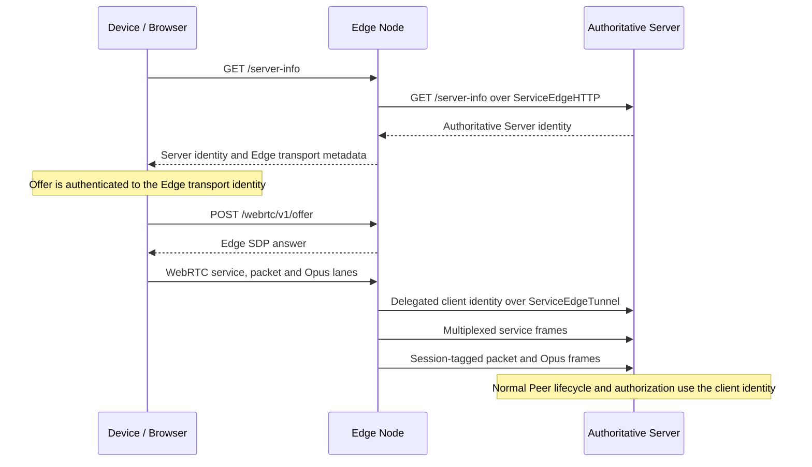
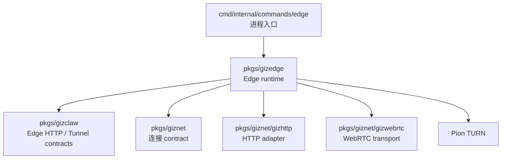

# pkgs/gizedge

`pkgs/gizedge` 提供 GizClaw 的 Edge Node ingress runtime。它在公网接收 browser 或 device 的 HTTP 请求，通过 `giznet` WebRTC connection 将请求转发到配置的 authoritative GizClaw Server。

启用 gateway 后，Edge 也是客户端 WebRTC transport 的终点，并把逻辑连接复用到有界的 Server upstream pool。Edge Node 仍不是业务数据的 owner；客户端 identity、最终授权、领域服务和资源存储均由上游 GizClaw Server 负责。

[Go API References](https://pkg.go.dev/github.com/GizClaw/gizclaw-go@v0.0.0-20260707135347-b9bf1fb24b9f/pkgs/gizedge)

## 目录结构

```text
pkgs/gizedge/
├── config.go     # Edge workspace 配置与边界检查
├── edge.go       # Public ingress、上游连接和请求转发 runtime
├── gateway.go    # Client 终止、逻辑连接与有界 upstream pool
└── turn.go       # 可选 TURN server runtime
```

`pkgs/gizedge` 当前是一个扁平 package。这里的代码共同构成单个 Edge Node runtime，还没有需要拆成独立公共子 package 的内部模块。

## Device 连接泳道

Edge Node 启动后已经通过 WebRTC 建立到 authoritative Server 的 giznet connection。Device 再通过 Edge 完成 Server discovery 和 WebRTC signaling：


```mermaid
sequenceDiagram
    participant Device as Device / Browser
    participant Edge as Edge Node
    participant Server as Authoritative Server

    Device->>Edge: GET /server-info
    Edge->>Server: GET /server-info over ServiceEdgeHTTP
    Server-->>Edge: Authoritative Server identity
    Edge-->>Device: Server identity and Edge transport metadata

    Note over Device: Offer is authenticated to the Edge transport identity
    Device->>Edge: POST /webrtc/v1/offer
    Edge-->>Device: Edge SDP answer
    Device->>Edge: WebRTC service, packet and Opus lanes
    Edge->>Server: Delegated client identity over ServiceEdgeTunnel
    Edge->>Server: Multiplexed service frames
    Edge->>Server: Session-tagged packet and Opus frames
    Note over Server: Normal Peer lifecycle and authorization use the client identity
```

这条链路中的 ownership 是：

- `/server-info.public_key` 始终是 authoritative Server identity；`transport.public_key`、`transport.endpoint` 和 `transport.signaling_path` 只选择本次 Edge WebRTC transport。客户端不能把 transport identity 当作业务 Server identity。
- Edge 校验 signaling 并创建客户端 PeerConnection，但不会以 Edge identity 代替客户端。它向 Server 发送短时、不可重放的 delegated envelope，包含物理 Edge identity、逻辑客户端 public key、目标 Server identity、有效期和远端地址。
- Server 只接受 active `edge-node` 打开的 `ServiceEdgeTunnel`，验证 delegated envelope 后，再以逻辑客户端 public key 进入正常 Peer lifecycle、service policy 和领域授权。
- 可靠 service stream 走每个逻辑会话的一条 tunnel control DataChannel；direct packet 与 Opus 保持独立的不可靠 session-tagged packet lane，避免可靠有序隧道产生 head-of-line blocking 或改变媒体语义。
- Gateway transport 不把 authoritative Server 的 ICE/TURN server 列表返回给客户端，因此正常 gateway 路径不会为每个客户端创建 Server TURN allocation。

Edge 不在本地执行 GizClaw domain handler，也不建立第二套业务权限模型。

## 目录职责

### Edge 配置

Edge workspace 配置描述当前节点运行所需的基础信息：

- Edge Node 自身的 giznet identity。
- Public HTTP listen address 和对外 endpoint。
- 单个 upstream Server 的 endpoint 与 public key。
- TLS certificate source 的选择。
- 可选 TURN listener、public endpoint、relay address、credential 和 relay port range。
- 可选 gateway ICE UDP listener、public UDP endpoint、容量、upstream pool、buffer、idle 和 drain 边界。

配置属于 Edge runtime，不复用 GizClaw Server 的 storage、service 或 domain 配置。Server config 也不应承担 Edge 进程的 public ingress 和 TURN 参数。

当前 TLS certificate source 只有 disabled 路径可运行；Edge RPC 和 file certificate source 仍未实现。开发指引不能把这些配置值写成已支持能力。

### Public Ingress

Public ingress 负责：

- 监听 Edge Node 的 public HTTP endpoint。
- 将允许的 browser/device API 请求转发给 authoritative Server。
- 为浏览器请求提供 ingress 所需的 CORS 行为。
- 在 server-info response 中发布 Edge Node 对外 endpoint。
- 在进程停止时关闭 HTTP server、上游 connection 和相关 listener。

Edge ingress 不拥有 Peer HTTP、OpenAI-compatible HTTP 或其他 product route 的业务实现。具体 route 由 `pkgs/gizclaw` Server 提供，Edge 只转发公开 surface。

### Upstream Connection

Edge Node 使用 `pkgs/giznet/gizwebrtc` 连接配置的 authoritative Server。`ServiceEdgeHTTP` 承载 public HTTP forwarding，`ServiceEdgeTunnel` 承载 gateway logical sessions。

每条 gateway upstream 是一条独立的 WebRTC PeerConnection 和 SCTP
association；每个 logical session 在选中的 upstream 上拥有自己的
`ServiceEdgeTunnel` DataChannel。多个 DataChannel 仍共享 association 级的拥塞控制和
调度，因此 pool 在有剩余 `max-upstreams` 配额时，先为新的 active session 建立独立
upstream，再开始复用已有 association。pool 满后使用 least-active 选择。

默认每条 upstream 最多保持 2048 个 active logical sessions；一条 upstream 累计打开
8192 个 tunnel streams 后进入 draining，不再接收新会话，现有会话结束后关闭并由新
upstream 替换。扩容失败只是吞吐优化失败；只要已有 healthy upstream 仍有 session
容量，admission 会回退到已有 upstream。单条 upstream 失败只关闭固定在该连接上的会话，
其他 upstream 和其他 Edge 不受影响。

HTTP forwarding 和 gateway upstream 都属于长生命周期 runtime 状态。Edge package 不应通过自行复制 GizClaw handler 来规避上游不可用。

### Gateway 容量与生命周期

Gateway 的默认总容量为 30,000 sessions，最多 16 条 upstream。信令进入时先同时预留 handshake、总 session 和 upstream stream 容量；没有容量时返回稳定的 `503` JSON error `gateway_over_capacity` 和 `Retry-After: 1`，不会先在 Server 创建半连接。

每个 session 默认最多缓冲 1 MiB tunnel bytes。单个 logical service 的读取方暂时变慢时，
tunnel 在有界队列上反压该 session 的可靠 stream，不会因为队列瞬时填满而截断 firmware
等大文件；超过 session 总 buffer 或单 frame 上限的输入仍会关闭该 session，而不是无限增长。
5 分钟无 activity 的 session 默认被回收。进程关闭时先停止新 admission，在 30 秒 drain
deadline 内保留现有 session，超时后强制关闭。

30,000 是可配置 harness 在具体主机上的容量模型目标，不是每条 upstream、每个 Edge 或任意硬件的无条件保证。harness 为每个 logical session 创建一个真实客户端 WebRTC PeerConnection；因此 load driver 本身也有显著内存、goroutine、FD 和 CPU 成本。达到 30,000 前必须为 load driver、各 Edge 和 Server 分别制定资源预算；单机不足时应在多个 load-driver 进程或主机间分片总 session 数，不能把降低 activity 或改用 synthetic session 当作通过。

本机基线入口启动一个 Server 和两个独立身份的 Edge，建立并保持 100 个真实客户端
PeerConnection。所有 session 先完成有界 ping，然后通过同一个 start barrier 同时执行
每路 4 MiB upload，再同时执行每路 4 MiB download；测试最后继续保持连接一分钟并执行
多轮 ping：

```bash
bash tests/gizclaw-e2e/run_gateway_capacity_tests.sh
```

默认 artifact 写入 ignored 的
`tests/gizclaw-e2e/testdata/gateway-capacity-100.json`；可通过
`GIZCLAW_E2E_GATEWAY_CAPACITY_ARTIFACT` 选择其他输出路径。该入口要求 100/100
session 建立成功、所有 ping 成功、无 unexpected disconnect 或 identity crossover，
且两个 Edge 的每个 session 都有 upstream assignment。每个测速方向要求 100/100
完整传输。固定 gate 同时要求每个方向达到 `200 Mbps` aggregate floor，并且不低于
同一轮 32 MiB 单路 sustained baseline 的 0.8 倍。单路使用更大的 payload，避免短
burst 把基线抬高而产生 flaky ratio；绝对门槛会拒绝旧的十几 Mbps association ceiling，
保留倍率避免在单路已经跑满当前路径时错误要求线性扩展，同时仍拒绝明显并发退化。它只
证明当前本机 Docker 拓扑的 100 路并发传输基线，不是
30,000-session 实测，也不把本机 aggregate Mbps 当作其他网络的带宽承诺。

容量 artifact 记录 load-driver 的 GOOS、GOARCH、Go version 和 logical CPU，并包含建立失败、周期 ping RTT、每轮及每个 Edge/upstream 的 RTT/失败汇总、unexpected disconnect、identity crossover、RSS、Go/runtime active CPU estimate、FD、heap、收发 bytes，以及 Edge/upstream 分布。upload/download 分别记录单路基线、由共享 wall-clock 计算的 100 路 aggregate Mbps、每路速率分位数、完整字节数、失败，以及每个 Edge/upstream 的聚合结果；不能把各客户端 duration 相加或取最大值替代共享起止区间。每个内存和 CPU 资源点都携带数据源；无法读取 Linux `/proc/self/statm` 时，`rss_bytes` 明确标记为 `go_memstats_sys` fallback，不能作为完整进程 RSS。平台无法读取 FD 时该值为 `-1`。达到 crossover、unexpected disconnect、测速失败、绝对 Mbps 或保留倍率阈值时命令以非零状态退出。500/1,000-session 重复运行、长时间 soak、各进程资源斜率和 30,000-session 理论推算属于独立的扩展容量验收。

吞吐 sizing 以实测的单 association 吞吐 `B` 和同路径可用带宽 `W` 为输入。要达到
80% 路径利用率，所需 active upstream 数可先估为 `ceil(0.8 × W / B)`，并且必须不大于
`max-upstreams`。以 `B = 10.10 Mbps`、`W = 200 Mbps` 的观测为例，估算需要 16 条
active upstream；这与默认上限一致。三个 active sessions 会先分配到三条 association，
因此在其他资源未饱和时，聚合吞吐应接近三倍单 association 吞吐，而不是继续停在
10–14 Mbps。

同一组默认值下，30,000 个 mostly-idle sessions 平均为 1,875 sessions/upstream，低于
2,048 的硬上限。这只是 topology sizing：CPU、memory、FD、建立速率和低频 activity
仍须通过 100、500、1,000 等递增样本拟合资源斜率，不能由这个除法或一次吞吐 benchmark
代替。可重复的 transport 与完整 Edge benchmark 命令为：

```bash
go test -tags giznet_e2e ./tests/giznet-e2e/webrtc \
  -run '^$' -bench BenchmarkWebRTCServiceThroughput -benchtime=1x -count=5
go test ./pkgs/gizedge \
  -run '^$' -bench BenchmarkGatewayServiceThroughput -benchtime=1x -count=5
```

部署后的 Docker suite 会分别记录 upload-only 和 download-only 的单客户端与三客户端观测。
默认只记录结果。受控 runner 可在链路仍有余量时设置最小客户端/聚合倍率，或根据独立测得
的可用带宽设置分方向 aggregate Mbps 下限：

```bash
GIZCLAW_E2E_SPEED_MIN_UPLOAD_AGGREGATE_MBPS='<upload floor>' \
GIZCLAW_E2E_SPEED_MIN_DOWNLOAD_AGGREGATE_MBPS='<download floor>' \
go test -tags gizclaw_e2e ./tests/gizclaw-e2e/go/edge \
  -run '^TestGatewaySpeedOneVersusThreeClients$' -count=1 -v
```

未饱和 runner 仍可使用 `GIZCLAW_E2E_SPEED_MIN_CLIENT_RATIO` 和
`GIZCLAW_E2E_SPEED_MIN_AGGREGATE_SCALE`。当单客户端已经接近可用链路上限时，不应只用
倍率门槛判断。

### TURN

Edge Node 可以同时运行可选的 TURN UDP relay，为无法直接建立 WebRTC 路径的连接提供 relay 能力。

TURN runtime 只负责 relay listener、认证和 relay port range。它不负责 GizClaw 用户登录、Peer resource access、route assignment 或业务授权。TURN credential 与 GizClaw resource credential 也不是同一类数据。

## 依赖关系


```mermaid
flowchart TB
    Command["cmd/internal/commands/edge<br/>进程入口"] --> GizEdge["pkgs/gizedge<br/>Edge runtime"]
    GizEdge --> GizClaw["pkgs/gizclaw<br/>Edge HTTP / Tunnel contracts"]
    GizEdge --> Giznet["pkgs/giznet<br/>连接 contract"]
    GizEdge --> GizHTTP["pkgs/giznet/gizhttp<br/>HTTP adapter"]
    GizEdge --> GizWebRTC["pkgs/giznet/gizwebrtc<br/>WebRTC transport"]
    GizEdge --> TURN["Pion TURN"]
```

依赖方向是：

- CLI command 选择 workspace 并启动 `pkgs/gizedge`。
- `pkgs/gizedge` 消费 GizClaw 定义的 Edge service contract，但不依赖具体领域 service。
- Edge 使用 `giznet`、`gizhttp` 和 `gizwebrtc` 建立上游数据路径。
- `pkgs/gizclaw` 和 `pkgs/giznet` 不依赖 `pkgs/gizedge`。

## Ownership 边界

应该放在 `pkgs/gizedge`：

- Edge workspace 配置和 Edge-specific validation。
- Public ingress listener、proxy 和 Edge response rewrite。
- Edge 到 authoritative Server 的连接、登录、重连和转发生命周期。
- Client WebRTC termination、logical session admission、upstream pool 和 gateway shutdown。
- Edge Node 自己运行的 TURN relay。
- 只属于 Edge process 的 shutdown 和 cleanup 行为。

不应该放在 `pkgs/gizedge`：

- Peer、workspace、firmware、gameplay、social 或 Agent 领域服务。
- Authoritative resource storage 和最终 resource access 判断。
- Transport-independent connection contract 或通用 WebRTC 实现。
- GizClaw Server 的 HTTP/RPC handler。
- Server storage backend、migration 和 workspace runtime 组装。
- 全局 peer directory、mesh membership、跨 Server 数据同步或 route replication。

这些内容分别属于 `pkgs/gizclaw`、`pkgs/giznet`、`cmd/internal/server`，或者仍是 server mesh 的后续设计范围。

## 当前边界

当前 `pkgs/gizedge` 连接一个 authoritative Server，并同时支持 Edge HTTP ingress、可选 gateway termination 和可选 TURN relay。

它不等同于完整 server mesh：

- Edge Node 当前按配置连接一个 upstream Server。
- `ServiceEdgeHTTP` 已用于 public request forwarding。
- `ServiceEdgeTunnel` 已用于有界 upstream pool 上的 logical client sessions。
- Edge control-plane RPC、certificate distribution 和 TLS certificate source 尚未完整实现。
- Edge Node 不维护 mesh membership 或全局 peer/resource route registry。
- Server 之间不存在由这个 package 提供的数据复制和事件同步。

因此，新增能力时要先判断它是当前 Edge ingress 的职责，还是 server mesh control plane 的未来工作；不能因为能力与公网入口有关就直接写进 `pkgs/gizedge`。
