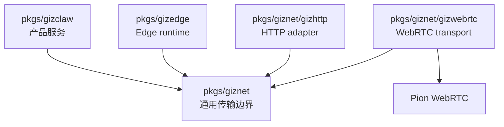

# pkgs/giznet

`pkgs/giznet` 是 GizClaw 的通用连接与传输层。它把上层服务与具体传输实现隔离开，使 GizClaw Server、Edge Node 和其他连接方能够使用统一的 peer connection、service stream 和 packet transport 能力。

这个目录不拥有 GizClaw 的产品业务。它只负责建立连接、识别 peer、承载 stream 或 packet，以及提供传输边界上的安全策略入口。

## 目录结构

```text
pkgs/giznet/
├── gizhttp/      # HTTP 与 giznet service stream 之间的通用适配
└── gizwebrtc/    # 基于 WebRTC 的 giznet transport
```

根 package 保存与具体 transport 无关的连接 contract 和基础类型。子 package 依赖根 package，实现或适配具体传输能力。

## 目录职责

### giznet

`pkgs/giznet` 根目录定义 transport-independent boundary，包括：

- Peer identity 和连接状态。
- Connection 与 listener 的公共抽象。
- Reliable service stream 和 direct packet 的传输模型。
- Peer 与 service 级别的安全策略入口。
- 所有 transport 实现共享的 protocol、key 和 error 定义。

这些定义必须保持与 GizClaw 业务无关。上层可以用它们承载不同服务，但根 package 不知道 Admin、Device、Agent、OTA 或 Gameplay 等产品概念。

### gizhttp

`pkgs/giznet/gizhttp` 负责在 giznet service stream 上承载标准 HTTP request 和 response。

它属于通用 transport adapter，只连接 HTTP 与 giznet，不拥有具体 route、handler、鉴权角色或业务 response。Peer HTTP、Admin HTTP 和 Edge HTTP 等具体 surface 由上层 package 组装。

### gizwebrtc

`pkgs/giznet/gizwebrtc` 是 giznet 的 WebRTC transport 实现，负责 WebRTC signaling、ICE、DataChannel、service stream、packet transport 和连接生命周期。

WebRTC 与 Pion 相关的实现细节留在这个子目录。上层 GizClaw 服务依赖 giznet boundary，不直接把 WebRTC 类型扩散到业务层。

## 依赖关系



依赖方向是：

- `pkgs/gizclaw` 和 `pkgs/gizedge` 消费 giznet 提供的通用传输边界。
- `gizhttp` 和 `gizwebrtc` 依赖 giznet 根 package 完成 transport adapter 或实现。
- `pkgs/giznet` 不反向依赖 `pkgs/gizclaw`、`pkgs/gizedge` 或具体业务 service。

## Ownership 边界

应该放在 `pkgs/giznet`：

- 所有连接方都可以复用的 peer、connection、listener、stream、packet、安全策略和传输基础定义。
- 不依赖具体 GizClaw 产品角色或业务资源的网络能力。

应该放在 `pkgs/giznet/gizwebrtc`：

- 只属于 WebRTC、ICE、signaling、DataChannel 或 Pion integration 的实现。
- giznet transport boundary 的 WebRTC 实现。

应该放在 `pkgs/giznet/gizhttp`：

- HTTP 与 giznet service stream 之间可被不同上层服务复用的适配逻辑。

不应该放在 `pkgs/giznet`：

- Admin、Peer、Edge 的具体 RPC method、HTTP route 或 service ID ownership。
- Device、Agent、OTA、Gameplay、Social 和其他业务服务。
- Server storage、workspace、配置加载和 CLI 启动组装。
- Firmware、board、desktop UI 或浏览器产品逻辑。
- 只对单个 GizClaw 业务 surface 有意义的授权规则。

这些内容分别属于 `pkgs/gizclaw`、`pkgs/gizedge`、`cmd/internal/server` 或对应客户端目录。
