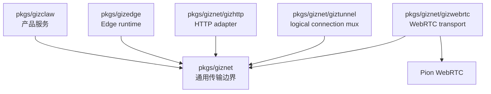

# pkgs/giznet

`pkgs/giznet` 是 GizClaw 的通用连接与传输层。它把上层服务与具体传输实现隔离开，使 GizClaw Server、Edge Node 和其他连接方能够使用统一的 peer connection、service stream 和 packet transport 能力。

这个目录不拥有 GizClaw 的产品业务。它只负责建立连接、识别 peer、承载 stream 或 packet，以及提供传输边界上的安全策略入口。

[Go API References](https://pkg.go.dev/github.com/GizClaw/gizclaw-go@v0.0.0-20260707135347-b9bf1fb24b9f/pkgs/giznet)

## 目录结构

```text
pkgs/giznet/
├── gizhttp/      # HTTP 与 giznet service stream 之间的通用适配
├── giztunnel/    # 在一个物理连接上复用逻辑 giznet connection
└── gizwebrtc/    # 基于 WebRTC 的 giznet transport
```

根 package 保存与具体 transport 无关的连接 contract 和基础类型。子 package 依赖根 package，实现或适配具体传输能力。

## 目录职责

### giznet

`pkgs/giznet` 根目录定义 transport-independent boundary，包括：

- Peer identity 和连接状态。
- Connection 与 listener 的公共抽象。
- Reliable service stream 和 direct packet 的传输模型。
- Peer 与 service 级别的安全策略入口。
- 所有 transport 实现共享的 protocol、key 和 error 定义。

这些定义必须保持与 GizClaw 业务无关。上层可以用它们承载不同服务，但根 package 不知道 Admin、Device、Agent、OTA 或 Gameplay 等产品概念。

### gizhttp

`pkgs/giznet/gizhttp` 负责在 giznet service stream 上承载标准 HTTP request 和 response。

它属于通用 transport adapter，只连接 HTTP 与 giznet，不拥有具体 route、handler、鉴权角色或业务 response。Peer HTTP、Admin HTTP 和 Edge HTTP 等具体 surface 由上层 package 组装。

### gizwebrtc

`pkgs/giznet/gizwebrtc` 是 giznet 的 WebRTC transport 实现，负责 WebRTC signaling、ICE、DataChannel、service stream、packet transport 和连接生命周期。

WebRTC 与 Pion 相关的实现细节留在这个子目录。上层 GizClaw 服务依赖 giznet boundary，不直接把 WebRTC 类型扩散到业务层。

`DialConfig.OnTiming` 可选地在 `Dial` 返回前接收一次 `DialTiming` snapshot，记录客户端
PeerConnection、offer、ICE gathering、signaling、remote description、ICE connected、
DTLS connected 和 DataChannel ready timing，且不会向调用方暴露可变 Pion 对象。

`giznet.Conn` 保持 transport-independent 的 `Dial` surface。能够取消 pending service open
的 transport 可以额外实现 `giznet.ContextDialer`。`gizwebrtc.Conn.DialContext` 在 context
结束时只关闭尚未打开的 DataChannel，不关闭父 PeerConnection。DataChannel 在 open 前 close
或 error 时返回 `gizwebrtc.ErrServiceOpen`，父连接关闭仍匹配 `giznet.ErrConnClosed`。原有
`Dial` 保持为十秒 service-open 上限的兼容 wrapper。

普通 public client association 保留 Pion 默认 SCTP receive window。Edge gateway 最多为
当前已准入的 64 条 client association 提供 4 MiB burst window，把每个 Edge 的 burst
profile receive credit 限制在 256 MiB；额度释放前，后续 association 仍使用默认窗口。独立的
32 MiB association 级窗口只用于有界的 Edge-to-Server upstream：Edge 在配置的
`max-upstreams` 上限内显式请求该窗口，Server 只在认证 peer 是 active `edge-node` 后选择
该窗口。它与验收 burst 中 64 条正在传输
的 service streams 各自 512 KiB 的 DataChannel send budget 一致，避免 interleaved partial
messages 在交付前耗尽 receiver window。每条 connection 最多接收远端打开的 2,048 条
service DataChannel，与 gateway 每条 upstream association 的 active-session 上限一致；
超出上限的 channel 会在交付前关闭，service label 不能创建无界 queue。SCTP
retransmission 上限为 250 ms，DTLS flight
的 initial retransmission interval 为 250 ms，使 burst 中丢失 handshake flight 时不会固定
增加默认的 1 秒等待。SCTP reliable delivery 和 retransmission count 不变；DTLS
retransmission 与 exponential backoff 仍然启用。

### giztunnel

`pkgs/giznet/giztunnel` 在一条物理 `giznet.Conn` 上承载多个逻辑 connection。每个逻辑 session 有不可复用的 16-byte session ID、一条可靠有序 control stream，以及共享物理 packet channel 上带 session ID 的不可靠 packet frame。

control stream 使用版本化 binary frame，复用逻辑 service stream 的 open、data、close 和
session close。open envelope 是严格 JSON，供上层验证 client、Edge 与 Server identity；
通用 tunnel package 不拥有 GizClaw role 或授权规则。每个 session 的 frame、buffer、queue
和 handshake 都有上界；logical service 的消费方变慢时，tunnel 在有界队列上反压该
session，而不是把瞬时 queue 满误判成非法输入。超过 session 总 buffer、未知 session、
重复 ID、非法 frame 或嵌套 tunnel protocol 仍会被拒绝。

`ProtocolOpusPacket` 在逻辑 connection API 中仍是 Opus packet，但 tunnel wire 把它放在不可靠 packet lane。它不会进入可靠 control stream，因而不会让丢包敏感媒体等待 RPC/HTTP bytes。

## 依赖关系


```mermaid
flowchart TB
    GizClaw["pkgs/gizclaw<br/>产品服务"] --> Giznet["pkgs/giznet<br/>通用传输边界"]
    GizEdge["pkgs/gizedge<br/>Edge runtime"] --> Giznet
    GizHTTP["pkgs/giznet/gizhttp<br/>HTTP adapter"] --> Giznet
    GizTunnel["pkgs/giznet/giztunnel<br/>logical connection mux"] --> Giznet
    GizWebRTC["pkgs/giznet/gizwebrtc<br/>WebRTC transport"] --> Giznet
    GizWebRTC --> WebRTC["Pion WebRTC"]
```

依赖方向是：

- `pkgs/gizclaw` 和 `pkgs/gizedge` 消费 giznet 提供的通用传输边界。
- `gizhttp` 和 `gizwebrtc` 依赖 giznet 根 package 完成 transport adapter 或实现。
- `pkgs/giznet` 不反向依赖 `pkgs/gizclaw`、`pkgs/gizedge` 或具体业务 service。

## Ownership 边界

应该放在 `pkgs/giznet`：

- 所有连接方都可以复用的 peer、connection、listener、stream、packet、安全策略和传输基础定义。
- 不依赖具体 GizClaw 产品角色或业务资源的网络能力。

应该放在 `pkgs/giznet/gizwebrtc`：

- 只属于 WebRTC、ICE、signaling、DataChannel 或 Pion integration 的实现。
- giznet transport boundary 的 WebRTC 实现。

应该放在 `pkgs/giznet/gizhttp`：

- HTTP 与 giznet service stream 之间可被不同上层服务复用的适配逻辑。

应该放在 `pkgs/giznet/giztunnel`：

- 与产品 role 无关的 logical session、service multiplexing、packet demultiplexing、buffer bound 和 bridge。

不应该放在 `pkgs/giznet`：

- Admin、Peer、Edge 的具体 RPC method、HTTP route 或 service ID ownership。
- Device、Agent、OTA、Gameplay、Social 和其他业务服务。
- Server storage、workspace、配置加载和 CLI 启动组装。
- Firmware、board、desktop UI 或浏览器产品逻辑。
- 只对单个 GizClaw 业务 surface 有意义的授权规则。

这些内容分别属于 `pkgs/gizclaw`、`pkgs/gizedge`、`cmd/internal/server` 或对应客户端目录。
