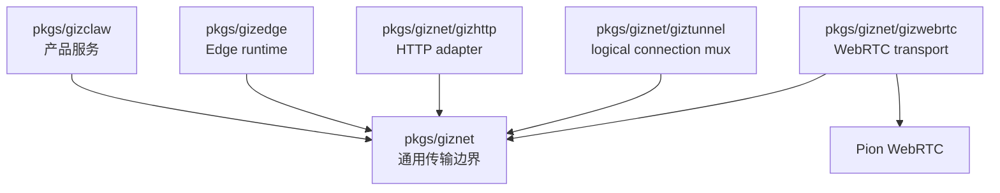

# pkgs/giznet

`pkgs/giznet` 是 GizClaw 的通用连接与传输层。它把上层服务与具体传输实现隔离开，使 GizClaw Server、Edge Node 和其他连接方能够使用统一的 peer connection、service stream 和 packet transport 能力。

这个目录不拥有 GizClaw 的产品业务。它只负责建立连接、识别 peer、承载 stream 或 packet，以及提供传输边界上的安全策略入口。

[Go API References](https://pkg.go.dev/github.com/GizClaw/gizclaw-go@v0.0.0-20260707135347-b9bf1fb24b9f/pkgs/giznet)

## 目录结构

```text
pkgs/giznet/
├── gizhttp/      # HTTP 与 giznet service stream 之间的通用适配
├── giztunnel/    # 在一个物理连接上复用逻辑 giznet connection
└── gizwebrtc/    # 基于 WebRTC 的 giznet transport
```

根 package 保存与具体 transport 无关的连接 contract 和基础类型。子 package 依赖根 package，实现或适配具体传输能力。

## 目录职责

### giznet

`pkgs/giznet` 根目录定义 transport-independent boundary，包括：

- Peer identity 和连接状态。
- Connection 与 listener 的公共抽象。
- Reliable service stream 和 direct packet 的传输模型。
- Peer 与 service 级别的安全策略入口。
- 所有 transport 实现共享的 protocol、key 和 error 定义。

这些定义必须保持与 GizClaw 业务无关。上层可以用它们承载不同服务，但根 package 不知道 Admin、Device、Agent、OTA 或 Gameplay 等产品概念。

### gizhttp

`pkgs/giznet/gizhttp` 负责在 giznet service stream 上承载标准 HTTP request 和 response。

它属于通用 transport adapter，只连接 HTTP 与 giznet，不拥有具体 route、handler、鉴权角色或业务 response。Peer HTTP、Admin HTTP 和 Edge HTTP 等具体 surface 由上层 package 组装。

### gizwebrtc

`pkgs/giznet/gizwebrtc` 是 giznet 的 WebRTC transport 实现，负责 WebRTC signaling、ICE、DataChannel、service stream、packet transport 和连接生命周期。

WebRTC 与 Pion 相关的实现细节留在这个子目录。上层 GizClaw 服务依赖 giznet boundary，不直接把 WebRTC 类型扩散到业务层。

`DialConfig.OnTiming` 可选地在 `Dial` 返回前接收一次 `DialTiming` snapshot，记录客户端
PeerConnection、offer、ICE gathering、signaling、remote description、ICE connected、
DTLS connected 和 DataChannel ready timing，且不会向调用方暴露可变 Pion 对象。

成功 Dial 时，snapshot 还包含一个 immutable、address-free 的 selected ICE pair：local/remote
candidate type、protocol、address family、component、nomination/state，以及 Pion 可提供的
有界 pair counters。它明确不保留 candidate ID、地址、端口、priority、foundation、URL、
SDP 或 credential；可选 counter 缺失时保持 unsupported，不伪造数值。Callback 与 snapshot
仍只是 transport diagnostics；`giznet.Conn` 不暴露 Pion object，也不引入 Edge-specific
contract。

2026-08-04 的 same-head 因果诊断只使用这层 public Giznet transport，不包含产品 Edge 或
Server。每方向三次 32 MiB 测得 direct 818/798 Mbps、REST Coturn 488/526 Mbps
（relay/direct 为 0.597 和 0.659），Coturn receive/send counter 同时增长约 220/219 MB。
结合产品矩阵，这在 Edge/Server boundary 之下复现了 material 差异，并把本机结果归因到
Coturn relay path。它仍只是本机 Docker transport 诊断，不是 production 或 WAN SLA。

`giznet.Conn` 保持 transport-independent 的 `Dial` surface。能够取消 pending service open
的 transport 可以额外实现 `giznet.ContextDialer`。`gizwebrtc.Conn.DialContext` 在 context
结束时只关闭尚未打开的 DataChannel，不关闭父 PeerConnection。DataChannel 在 open 前 close
或 error 时返回 `gizwebrtc.ErrServiceOpen`，父连接关闭仍匹配 `giznet.ErrConnClosed`。原有
`Dial` 保持为十秒 native service-open 上限的兼容 wrapper。`giztunnel.Conn` 也实现
`ContextDialer`：它最多等待 bridge drain 上限加一秒来获取 active-channel capacity，之后再应用
十秒 native-open 上限。更短的 caller context 同时约束这两个阶段。

每条已打开的 service DataChannel 都会登记在对应 logical service 下，直到相应的 `net.Conn`
关闭。Stream 关闭时会立即解除登记；service 或父连接关闭时，则在 registry lock 外关闭已
截取的 listener 与 stream snapshot。因此反复创建的短生命周期 RPC stream 不会在父
WebRTC connection 中累积，同时 service 与父连接 shutdown 仍会拒绝新 stream，并关闭所有
仍存活的 stream。

每个 unary RPC 独占一条有序 service DataChannel：客户端为该请求新建 DataChannel，服务端
只在其中处理一个请求，响应完成后双方关闭它。已关闭的 DataChannel 不会承载后续 RPC。
对应的 SCTP stream ID 会一直保留，直到本端发出的 reset 已获确认，且对端发出的 reset 已移除
旧的 inbound stream；之后 allocator 才能把这个 ID 分配给新的 DataChannel。这里复用的是
有限的 ID 空间，不是 DataChannel 或 RPC stream。

根 Go module 暂时把 `github.com/pion/sctp` 和 `github.com/pion/webrtc/v4` replace 到固定的
GizClaw fork pseudo-version，用于报告已完成的 stream reset 并释放 DataChannel ID。Go 不会
向下游传播依赖 module 的 `replace`，因此把 GizClaw 作为 module 使用的 executable 在上游
release 同时包含这两项修复前，也必须复制这两条 replacement。选择包含两项修复的上游
release，并在不使用 fork 时通过 reset/reuse integration test 和 race test 后，才能同时移除
两条 replacement。

Service stream 在首次读取时惰性分配 32 KiB detached-DataChannel message
buffer，之后的读取重复使用它。如果 SCTP 报告当前排队 message 更大，该 stream
会在不消费 message 的情况下把 buffer 增长到最大 64 KiB 并重试。如果调用方未一次
读完，则把剩余部分复制到该 stream 自有的 pending buffer。Buffer 随 stream 关闭
释放，因此既不会让每条小 message stream 都保留最大尺寸 buffer，也不会由进程级
pool 保留短时 burst 的高水位。

每个 PeerConnection 会用一个重复使用的 MTU 大小 buffer 持续读取本地 Opus sender 的 RTCP
feedback；Pion 随 PeerConnection 关闭 sender 时 reader 随即退出。因此长连接中未消费的
receiver report 不会在 SRTCP packet buffer 内持续累积。

普通 public client association 保留 Pion 默认 SCTP receive window。Edge gateway 最多为
当前已准入的 64 条 client association 提供 4 MiB burst window，把每个 Edge 的 burst
profile receive credit 限制在 256 MiB；额度释放前，后续 association 仍使用默认窗口。独立的
32 MiB association 级窗口只用于有界的 Edge-to-Server upstream：Edge 在配置的
`max-upstreams` 上限内显式请求该窗口，Server 只在认证 peer 是 active `edge-node` 后选择
该窗口。它与验收 burst 中 64 条正在传输
的 service streams 各自 512 KiB 的 DataChannel send budget 一致，避免 interleaved partial
messages 在交付前耗尽 receiver window。每条 connection 最多接收远端打开的 2,048 条
service DataChannel，与 gateway 每条 upstream association 的 active-session 上限一致；
超出上限的 channel 会在交付前关闭，service label 不能创建无界 queue。
默认客户端 Dial 为每条 PeerConnection 独占一个 wildcard IPv4 UDP mux 和 socket。同一
connection 的所有本地网卡 host candidates 共用一个由 OS 保证唯一的 source port，避免
NAT 把各网卡独立分配的相同端口折叠成同一个 remote tuple。这个 mux 不跨
PeerConnection 共享，因为 Pion 在 STUN 之后按 remote address 分发 packet。每个客户端
私有 socket 的 read/write buffer 都请求 256 KiB；4 MiB buffer 只用于被多条
PeerConnection 共享的 listener socket。设置 remote description 后，默认 Dial 会给第一次
ICE attempt 6 秒来打开 packet DataChannel；如果等待超时且调用方 context 仍有效，它会
关闭该 PeerConnection 及其 socket，并且只用一个全新的本地 tuple 再尝试一次，不继续
使用已经失效的 NAT mapping。调用方提供 Pion API 时，transport ownership 在调用方，
仍然只尝试一次。Capacity artifact 会记录每条 session 的 attempt 次数。SCTP
retransmission 上限为 150 ms，DTLS flight
的 initial retransmission interval 为 150 ms，使 burst 中丢失 handshake flight 时不会固定
增加默认的 1 秒等待。SCTP reliable delivery 和 retransmission count 不变；DTLS
retransmission 与 exponential backoff 仍然启用。ICE candidate pair 保留 25 次 binding
request 机会，按 Pion 的 200 ms check interval 约为 5 秒，避免同步 burst 期间的
短时 relay 丢包永久淘汰有效 pair；整个 handshake 仍由调用方的 Dial context 限定。
packet DataChannel 超时时会输出最终 PeerConnection、ICE、DTLS、SCTP 状态和
candidate-pair 计数，用于诊断。

### giztunnel

`pkgs/giznet/giztunnel` 把一条 physical WebRTC PeerConnection 上的原生 DataChannel 聚合为
多个 logical `giznet.Conn`。每个 session 有随机 16-byte ID、一条可靠有序 control
channel、一条无序且 `maxRetransmits=0` 的 packet channel，以及每条 Event、RPC、HTTP 或
其他 service 独立的可靠有序 channel。service payload 只保留原有上层 framing，不再包含
virtual open/data/close frame。

canonical `giznet/v2/tunnel/...` label 声明 session、logical client、service 与 channel
instance。只有已经认证并激活为 `edge-node` 的 physical connection 才注册该 namespace；
control label 是 logical identity 的唯一声明。Server 收齐 control 与 packet 后仍要由应用
显式 Accept 并发送精确的 `GZT2` result，DCEP open 本身不是 logical acceptance。

Direct packet 在每 session 的 unreliable channel 保留消息边界。`ProtocolOpusPacket` 继续
使用 shared physical unreliable lane 上带 version 和 session ID 的 envelope，并合并回
logical `Read`/`Write`；它不进入可靠 channel。原生 channel 隔离 ordering、buffered-amount
backpressure 与 close/reset，但同一 PeerConnection 上的 channel 仍共享 SCTP association
和 congestion controller。

active limit 默认是每 session 32 条、每 upstream 8192 条。可靠 service write 同时受
per-channel、per-session 与 32 MiB association budget 约束，reservation 要等
`BufferedAmount` 排空后才释放。

`giztunnel.Bridge` 保持为兼容 forwarding API：两条 service accept loop 与两条 packet copy
loop 中第一个 connection-level loop 结束时关闭两端。`BridgeWithObservation` 保持完全相同的
forwarding、connection close 与返回错误归一化，同时返回一个有界 `BridgeObservation`。
Observation 记录首个 terminal 的 `service` 或 `packet` path、`left_to_right` 或
`right_to_left` direction、`accept_source`、`read_source` 或 `write_destination` phase，
以及 `clean`、`eof`、`closed`、`connection_closed`、`service_mux_closed`、
`buffer_limit`、`context_canceled`、`deadline_exceeded` 或 `other` 封闭 error class。
因此 EOF 与 closed error 对 `Bridge` caller 仍返回 nil，但诊断类别不会丢失。

Destination service open 达到 established session 的 per-session 或 association active-channel
capacity 时，会等待已有 lease 释放，而不是立即拒绝已经 accept 的 source stream。Lease
释放会唤醒等待者重新准入。Caller context 和内部有界 timeout 限制等待时间；容量在
边界内仍未释放时，error 同时保留 deadline 和精确 capacity snapshot。其他 destination
service open 失败仍只关闭 source stream，service loop 继续运行。Observation 只聚合总次数以及
first/last direction 和封闭 error class，不为每条 stream 发 callback 或日志。独立 drain 的
per-service copy goroutine 不参与 connection terminal 竞争。有界 capacity wait 超时时，第一次
此类 rejection 还会携带 Router lock 内捕获的责任 scope 与匹配的 active/limit snapshot。
Pending-session limit、close race、普通 buffer limit、packet buffer 与
remote queue 不携带精确 capacity 字段。

## 依赖关系


```mermaid
flowchart TB
    GizClaw["pkgs/gizclaw<br/>产品服务"] --> Giznet["pkgs/giznet<br/>通用传输边界"]
    GizEdge["pkgs/gizedge<br/>Edge runtime"] --> Giznet
    GizHTTP["pkgs/giznet/gizhttp<br/>HTTP adapter"] --> Giznet
    GizTunnel["pkgs/giznet/giztunnel<br/>logical connection mux"] --> Giznet
    GizWebRTC["pkgs/giznet/gizwebrtc<br/>WebRTC transport"] --> Giznet
    GizWebRTC --> WebRTC["Pion WebRTC"]
```

依赖方向是：

- `pkgs/gizclaw` 和 `pkgs/gizedge` 消费 giznet 提供的通用传输边界。
- `gizhttp` 和 `gizwebrtc` 依赖 giznet 根 package 完成 transport adapter 或实现。
- `pkgs/giznet` 不反向依赖 `pkgs/gizclaw`、`pkgs/gizedge` 或具体业务 service。

## Ownership 边界

应该放在 `pkgs/giznet`：

- 所有连接方都可以复用的 peer、connection、listener、stream、packet、安全策略和传输基础定义。
- 不依赖具体 GizClaw 产品角色或业务资源的网络能力。

应该放在 `pkgs/giznet/gizwebrtc`：

- 只属于 WebRTC、ICE、signaling、DataChannel 或 Pion integration 的实现。
- giznet transport boundary 的 WebRTC 实现。

应该放在 `pkgs/giznet/gizhttp`：

- HTTP 与 giznet service stream 之间可被不同上层服务复用的适配逻辑。

应该放在 `pkgs/giznet/giztunnel`：

- 与产品 role 无关的 logical session、service multiplexing、packet demultiplexing、buffer bound 和 bridge。

不应该放在 `pkgs/giznet`：

- Admin、Peer、Edge 的具体 RPC method、HTTP route 或 service ID ownership。
- Device、Agent、OTA、Gameplay、Social 和其他业务服务。
- Server storage、workspace、配置加载和 CLI 启动组装。
- Firmware、board、desktop UI 或浏览器产品逻辑。
- 只对单个 GizClaw 业务 surface 有意义的授权规则。

这些内容分别属于 `pkgs/gizclaw`、`pkgs/gizedge`、`cmd/internal/server` 或对应客户端目录。
