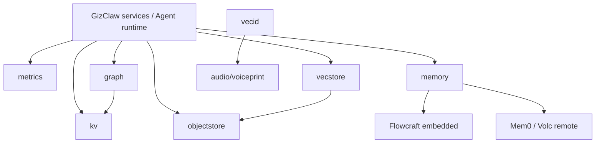

# pkgs/store 总览

`pkgs/store` 提供 GizClaw 多个领域共同使用的持久化与索引基础能力。这里定义 storage abstraction 和通用实现，不拥有 Peer、Agent、AI、Gameplay 或其他产品资源的业务规则。

## Package 结构

```text
pkgs/store/
├── graph/        # Entity / Relation graph abstraction
├── kv/           # Ordered hierarchical key-value store
├── logstore/     # 可查询的 immutable/mutable record 与 log driver
├── memory/       # Observation extraction、fact recall 与 provider adapters
├── metrics/      # Time-series sample write and query
├── objectstore/  # Prefix-addressable binary object storage
├── vecid/        # Vector locality-sensitive identity registry
└── vecstore/     # Vector similarity index
```

| Package | 核心边界 | 主要消费者 |
| --- | --- | --- |
| [graph](./graph) | Entity、Relation 与邻接查询 | Agent memory、recall |
| [kv](./kv) | 有序层级 key、CRUD 与范围遍历 | GizClaw services、Agent memory、其他 stores |
| [logstore](./logstore) | 追加/修改结构化 record、backend-neutral 查询与分页 | 进程日志、conversation/event 等生产者 |
| [memory](./memory) | 原始 observation、fact recall/update/delete 与异步 operation | Agent runtime、memory evaluation harness |
| [metrics](./metrics) | Sample 写入、instant/range query 与 aggregation | Peer telemetry、Server metrics |
| [objectstore](./objectstore) | Binary object、prefix list/delete 与 expiration | Firmware、workspace、gameplay assets、HNSW |
| [vecid](./vecid) | Vector hashing、bucket 与 identity 聚类 | Voiceprint detection |
| [vecstore](./vecstore) | Vector add/search/delete 与 HNSW persistence | Agent recall、memory index |

## 依赖关系



`cmd/internal/storage` 和 `cmd/internal/stores` 负责读取进程配置、选择具体 backend 并把 stores 注入 Server；`pkgs/store` 不读取 GizClaw Server config，也不决定某个领域使用哪个 physical backend。

## 放置规则

这里保存可跨领域复用的 storage interface、backend adapter 以及通用 key、query、index、expiration 与 persistence 语义。领域 resource schema、HTTP/RPC、authorization、进程配置和只属于单一领域的 repository 不应放入 `pkgs/store`。
