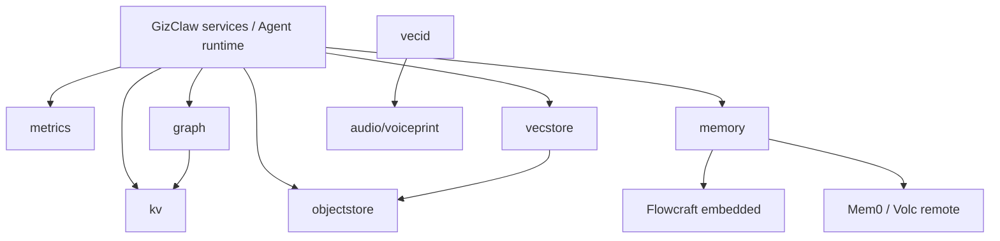

# pkgs/store 总览

`pkgs/store` 提供 GizClaw 多个领域共同使用的持久化与索引基础能力。这里定义 storage abstraction 和通用实现，不拥有 Peer、Agent、AI、Gameplay 或其他产品资源的业务规则。

## Package 结构

```text
pkgs/store/
├── graph/        # Entity / Relation graph abstraction
├── kv/           # Ordered hierarchical key-value store
├── logstore/     # 可查询的 immutable/mutable record 与 log driver
├── memory/       # Observation extraction、fact recall 与 provider adapters
├── metrics/      # Time-series sample write and query
├── objectstore/  # Prefix-addressable binary object storage
├── vecid/        # Vector locality-sensitive identity registry
└── vecstore/     # Vector similarity index
```

| Package | 核心边界 | 主要消费者 |
| --- | --- | --- |
| [graph](./graph) | Entity、Relation 与邻接查询 | Agent memory、recall |
| [kv](./kv) | 有序层级 key、CRUD 与范围遍历 | GizClaw services、Agent memory、其他 stores |
| [logstore](./logstore) | 追加/修改结构化 record、backend-neutral 查询与分页 | 进程日志、conversation/event 等生产者 |
| [memory](./memory) | 原始 observation、fact recall/update/delete 与异步 operation | Agent runtime、memory evaluation harness |
| [metrics](./metrics) | Sample 写入、instant/range query 与 aggregation | Peer telemetry、Server metrics |
| [objectstore](./objectstore) | Binary object、prefix list/delete 与 expiration | Firmware、workspace、gameplay assets、HNSW |
| [vecid](./vecid) | Vector hashing、bucket 与 identity 聚类 | Voiceprint detection |
| [vecstore](./vecstore) | Vector add/search/delete 与 HNSW persistence | Agent recall、memory index |

## 依赖关系


```mermaid
flowchart TB
    Domains["GizClaw services / Agent runtime"] --> KV["kv"]
    Domains --> Metrics["metrics"]
    Domains --> Objects["objectstore"]
    Domains --> Vectors["vecstore"]
    Domains --> Graph["graph"]
    Domains --> Memory["memory"]
    Memory --> Flowcraft["Flowcraft embedded"]
    Memory --> Remote["Mem0 / Volc remote"]
    Graph --> KV
    Vectors --> Objects
    VecID["vecid"] --> Voiceprint["audio/voiceprint"]
```

`cmd/internal/storage` 和 `cmd/internal/stores` 负责读取进程配置、选择具体 backend 并把 stores 注入 Server；`pkgs/store` 不读取 GizClaw Server config，也不决定某个领域使用哪个 physical backend。

### Server 组合契约

`storage` 是动态的物理 Data Connector 清单，拥有 driver/provider 配置、DSN 或 endpoint、credential、pool/client、readiness 与 lifecycle。`stores` 是第二个动态清单，它借用 connector，并通过 prefix、table、database 或 topic scope 暴露逻辑接口。固定类型的 `services` block 把内置消费者绑定到具备兼容能力的命名 Store。Registry 名称精确匹配，不具有任何保留 service 语义。

| Store kind | 接口与 scope |
| --- | --- |
| `keyvalue` | `kv.Store`；物理 KV connector 上可选的 key prefix |
| `sql` | 借用物理 `*sqlx.DB` pool；schema 由 service 拥有 |
| `objectstore` | `objectstore.ObjectStore`；可选 object prefix |
| `vecstore` | 物理 vector connector 上的 `vecstore.Index` |
| `graph` | 基于另一个逻辑 keyvalue Store 组合的 `graph.Graph` |
| `metrics` | `metrics.Store`；进程内 memory 或物理 Prometheus/ClickHouse connector |
| `log.immutable` | `logstore.ImmutableStore`；Volc topic 或 ClickHouse table |
| `log.mutable` | `logstore.MutableStore`；ClickHouse table |

ClickHouse 是物理 `sql` connector；Prometheus 与 Volc TLS 是物理 provider connector。逻辑 Store 只包含 connector 引用和 scope。多个 Store 可以借用同一个 connector；关闭逻辑 Store 不会关闭共享 connector。RuntimeProfile 与 MemoryLayout 选择的 Memory connection 仍在此 registry 之外。

### 进程 SQLite DSN 契约

`cmd/internal/storage` 接受 modernc SQLite DSN，并继续支持 `_pragma` 等
modernc 参数。连接的 `busy_timeout`、WAL journal mode 和 foreign-key PRAGMA
由 GizClaw 负责。`go-sqlite3` 兼容简写 `_busy_timeout`/`_timeout`、
`_foreign_keys`/`_fk`、`_journal_mode`/`_journal`、
`_synchronous`/`_sync`、`_auto_vacuum`/`_vacuum` 和 `_query_only` 不受支持，
并会在打开数据库前被拒绝。这样依赖升级不会静默改变数据库文件或连接行为；
如需不同策略，应在 storage 所拥有的代码中配置，而不是通过这些 DSN 简写。

## 放置规则

这里保存可跨领域复用的 storage interface、backend adapter 以及通用 key、query、index、expiration 与 persistence 语义。领域 resource schema、HTTP/RPC、authorization、进程配置和只属于单一领域的 repository 不应放入 `pkgs/store`。
