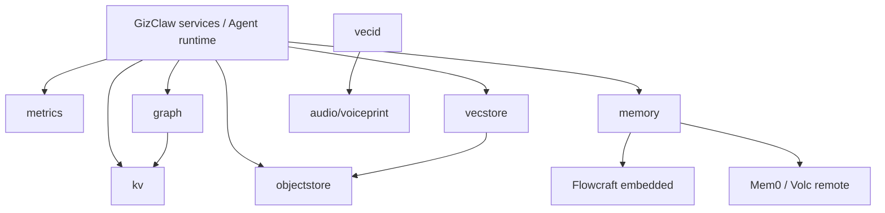

# pkgs/store 总览

`pkgs/store` 提供 GizClaw 多个领域共同使用的持久化与索引基础能力。这里定义 storage abstraction 和通用实现，不拥有 Peer、Agent、AI、Gameplay 或其他产品资源的业务规则。

## Package 结构

```text
pkgs/store/
├── graph/        # Entity / Relation graph abstraction
├── kv/           # Ordered hierarchical key-value store
├── logstore/     # 可查询的 immutable/mutable record 与 log driver
├── memory/       # Observation extraction、fact recall 与 provider adapters
├── metrics/      # Time-series sample write and query
├── objectstore/  # Prefix-addressable binary object storage
├── storage/      # 类型化物理连接配置、实例与生命周期
├── vecid/        # Vector locality-sensitive identity registry
└── vecstore/     # Vector similarity index
```

| Package | 核心边界 | 主要消费者 |
| --- | --- | --- |
| [graph](./graph) | Entity、Relation 与邻接查询 | Agent memory、recall |
| [kv](./kv) | 有序层级 key、CRUD 与范围遍历 | GizClaw services、Agent memory、其他 stores |
| [logstore](./logstore) | 追加/修改结构化 record、backend-neutral 查询与分页 | 进程日志、conversation/event 等生产者 |
| [memory](./memory) | 原始 observation、fact recall/update/delete 与异步 operation | Agent runtime、memory evaluation harness |
| [metrics](./metrics) | Sample 写入、instant/range query 与 aggregation | Peer telemetry、Server metrics |
| [objectstore](./objectstore) | Binary object、prefix list/delete 与 expiration | Firmware、workspace、gameplay assets、HNSW |
| [vecid](./vecid) | Vector hashing、bucket 与 identity 聚类 | Voiceprint detection |
| [vecstore](./vecstore) | Vector add/search/delete 与 HNSW persistence | Agent recall、memory index |

## 依赖关系


```mermaid
flowchart TB
    Domains["GizClaw services / Agent runtime"] --> KV["kv"]
    Domains --> Metrics["metrics"]
    Domains --> Objects["objectstore"]
    Domains --> Vectors["vecstore"]
    Domains --> Graph["graph"]
    Domains --> Memory["memory"]
    Memory --> Flowcraft["Flowcraft embedded"]
    Memory --> Remote["Mem0 / Volc remote"]
    Graph --> KV
    Vectors --> Objects
    VecID["vecid"] --> Voiceprint["audio/voiceprint"]
```

`cmd/internal/server` 独占 YAML DTO、严格解析、环境变量展开和 workspace 相对路径解析，再把普通 Go 配置传给公共包。`pkgs/store/storage` 打开并持有物理资源；根包 `pkgs/store` 校验 Storage/Store 组合并构造逻辑 Store。两个公共包都不读取 YAML 或 JSON，也不决定 service binding。

### Server 组合契约

`storage` 是动态的物理 Data Connector 清单。每个 `kind` 直接标识一个具体 backend，并拥有对应路径、DSN、endpoint、credential、pool/client、readiness 与 lifecycle。`stores` 根据 Store kind 与 Storage kind 的组合构造逻辑接口，并通过 prefix、table、database 或 topic scope 隔离数据。固定类型的 `services` block 把内置消费者绑定到具备兼容能力的命名 Store。Registry 名称精确匹配，不具有任何保留 service 语义。

| Store kind | 接口与 scope |
| --- | --- |
| `keyvalue` | `kv.Store`；Badger/memory 使用可选 key prefix；SQLite/PostgreSQL 使用必填 prefix，后端将它作为物理表名 |
| `sql` | 借用物理 `*sqlx.DB` pool；schema 由 service 拥有 |
| `objectstore` | `objectstore.ObjectStore`；可选 object prefix |
| `metrics` | `metrics.Store`；`memory`、Prometheus、ClickHouse，或 SQLite/PostgreSQL table |
| `log.immutable` | `logstore.ImmutableStore`；Volc topic、ClickHouse table 或 SQLite/PostgreSQL table |
| `log.mutable` | `logstore.MutableStore`；ClickHouse、SQLite 或 PostgreSQL table |

| Storage kind | 物理配置 |
| --- | --- |
| `badger` | `dir` |
| `memory` | 无属性 |
| `filesystem.dir` | `dir` |
| `sqlite` | `dir` 或 `dsn` 二选一 |
| `postgresql`、`clickhouse` | `dsn` |
| `prometheus` | remote-write/query URL 与可选 bearer token |
| `volc-tls` | endpoint、region 与 credential |

公共 Go API 不使用包含 `Kind` 和所有 backend 字段的通用属性结构。`storage.Config`
是由 package 封闭的配置接口，每个 backend 只暴露自身有效的字段：

```go
physical, err := storage.New(map[string]storage.Config{
	"main": storage.PostgreSQLConfig{DSN: postgresDSN},
	"cache": storage.BadgerConfig{Dir: cacheDir},
	"local": storage.MemoryConfig{},
})
```

具体实现包括 `BadgerConfig`、`MemoryConfig`、`FilesystemDirConfig`、
`SQLiteConfig`、`PostgreSQLConfig`、`ClickHouseConfig`、`PrometheusConfig`
和 `VolcTLSConfig`。因此 Go 调用方不能为 PostgreSQL 传入 `dir`，也不能为
Badger 传入 DSN 或 provider credential。`cmd/internal/server` 保留扁平 YAML DTO，
根据 `kind` 显式转换为对应的具体 Go 类型；YAML 字段不会进入公共配置类型。

多个 Store 可以借用同一个 connector；调用方必须先关闭逻辑 `Stores`，再关闭物理 `Storage`。`memory` 只是无状态 marker，每个引用它的 keyvalue 或 metrics Store 都创建独立实例。`vecstore` 与 `graph` 没有内置 Server 消费者，因此不属于命令层 Store 配置；对应公共 package 与构造函数仍保留。RuntimeProfile 与 MemoryLayout 选择的 Memory connection 仍在此 registry 之外。

SQLite/PostgreSQL KV 只声明一个单段 `prefix`；后端把它直接作为带引号的物理表名，表内 key 不再重复增加该 prefix。Metrics 和 Log Store 继续声明 `table`。这些物理名称都必须是未限定、最长 63 bytes 的 ASCII 名称；KV prefix 还可包含 `-`。同一 connector 上，schema contract 兼容的多个逻辑 Store 可以用完全相同的名称共享一张物理表；KV、Metrics 与 Log 等不兼容 contract 不能共享。SQLite 按 ASCII 大小写不敏感识别物理表，但共享声明必须使用完全相同的拼写以保持 index identity 稳定；PostgreSQL 按带引号的精确名称比较。Registry 在任何 DDL 前完成整组兼容性、scope 和 table claim 校验。构造函数直接用幂等的 `CREATE ... IF NOT EXISTS` 保证业务表与索引存在，再精确校验列、主键、identity 和索引；它不创建 schema version/history 表，也不导入或重写既有 backend 数据。兼容的既有表会直接复用，不兼容的定义会让启动失败。逻辑 `Close` 只关闭 adapter 状态，不关闭借用的 `*sqlx.DB`。

`storage.SQLTable` 是 SQLite/PostgreSQL 借用表的唯一 dialect、identifier、quoting、初始化和 schema inspection owner；它只能由校验后的 pool 与表名构造。KV、Metrics 和 Log 继续拥有各自的业务表定义，但直接消费这个 storage capability，不再经过独立的 SQL backend helper package。

### 进程 SQLite DSN 契约

`pkgs/store/storage` 接受 modernc SQLite DSN，并继续支持 `_pragma` 等
modernc 参数。连接的 `busy_timeout`、WAL journal mode 和 foreign-key PRAGMA
由 GizClaw 负责。`go-sqlite3` 兼容简写 `_busy_timeout`/`_timeout`、
`_foreign_keys`/`_fk`、`_journal_mode`/`_journal`、
`_synchronous`/`_sync`、`_auto_vacuum`/`_vacuum` 和 `_query_only` 不受支持，
并会在打开数据库前被拒绝。这样依赖升级不会静默改变数据库文件或连接行为；
如需不同策略，应在 storage 所拥有的代码中配置，而不是通过这些 DSN 简写。

## 放置规则

这里保存可跨领域复用的 storage interface、backend adapter 以及通用 key、query、index、expiration 与 persistence 语义。领域 resource schema、HTTP/RPC、authorization、进程配置和只属于单一领域的 repository 不应放入 `pkgs/store`。
